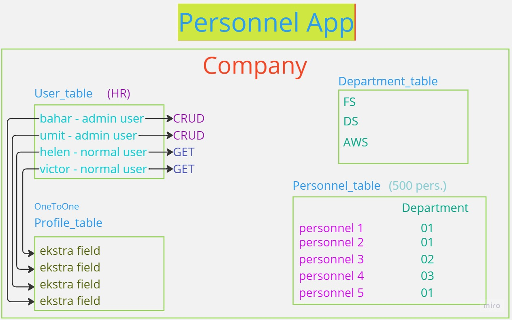

## Proje Taslak V.01

```powershell
- py -m venv env
- .\env\Scripts\activate
- pip install djangorestframework
- django-admin startproject main .
- pip install python-decouple
- py manage.py runserver
- py manage.py migrate
- pip freeze > requirements.txt
```

- add rest_framework to INSTALLED_APPS
- create .env and .gitignore (hidden to SECRET_KEY)

```powershell
- py manage.py runserver
- py manage.py migrate 
```

### PostgreSQL setup

- To get Python working with Postgres, you will need to install the “psycopg2” module.
(Python'un Postgres ile çalışmasını sağlamak için “psycopg2” modülünü kurmanız gerekecek.)

```powershell
- pip install psycopg2
- pip install psycopg2-binary # for macOS
- pip freeze > requirements.txt
```

### Install Swagger

- Dokümantasyon için kullanılır, backend de oluşturduğumuz endpointlerin daha doğrusu API nin dokümantasyonu.
- Swagger, 2010 yılında bir girişim tarafından başlatılan açık kaynaklı bir projedir. Amaç, bir framework uygulamaktır.kod ile senkronizasyonu korurken, geliştiricilerin API'leri belgelemesine ve tasarlamasına olanak sağlamaktır.
- Bir API geliştirmek, düzenli ve anlaşılır dokümantasyon gerektirir.
- API'leri Django rest frameworküyle belgelemek ve tasarlamak için gerçek oluşturan drf-yasg kullanacağız.
Bir Django Rest Framework API'sinden Swagger/Open-API 2.0 belirtimleri. belgeler burada bulabilirsin

- drf-yasg -> django rest_framework yet another swagger generator

- installation

```powershell
- pip install drf-yasg
- pip freeze > requirements.txt
```

- add drf-yasg to INSTALLED_APPS -> 'drf_yasg'

- swagger için güncellenmiş urls.py aşağıdaki gibidir. Swagger belgelerinde, bu modeller güncel değildir. urls.py'yi aşağıdaki gibi değiştiriyoruz.

urls.py ->

```py
from django.contrib import admin 
from django.urls import path 
 
# Three modules for swagger:
from rest_framework import permissions 
from drf_yasg.views import get_schema_view 
from drf_yasg import openapi 
 
schema_view = get_schema_view( 
    openapi.Info( 
        title="Taslak Project-Flight Reservation API", 
        default_version="v1",
        description="Taslak Project-Flight Reservation API project provides flight and reservation info", 
        terms_of_service="#", 
        contact=openapi.Contact(email="rafe@clarusway.com"),  # Change e-mail on this line! 
        license=openapi.License(name="BSD License"), 
    ), 
    public=True, 
    permission_classes=[permissions.AllowAny], 
) 
 
urlpatterns = [ 
    path("admin/", admin.site.urls), 
    # Url paths for swagger: 
    path("swagger(<format>\.json|\.yaml)", schema_view.without_ui(cache_timeout=0), name="schema-json"), 
    path("swagger/", schema_view.with_ui("swagger", cache_timeout=0), name="schema-swagger-ui"), 
    path("redoc/", schema_view.with_ui("redoc", cache_timeout=0), name="schema-redoc"), 
]
```


```powershell
- py manage.py runserver
- py manage.py migrate 
```

- swagger ı kurduk, urls.py daki ayarlarını da yaptık, http://127.0.0.1:8000/swagger/  endpointine istek attığımızda swagger ana sayfasını gördük.

### Install Debug Toolbar

- The Django Debug Toolbar is a configurable set of panels that display various debug information about the current request/response and when clicked, display more details about the panel’s content
  https://django-debug-toolbar.readthedocs.io/en/latest/
(Django Hata Ayıklama Araç Çubuğu, çeşitli hata ayıklama bilgilerini görüntüleyen yapılandırılabilir bir panel kümesidir. geçerli istek/yanıt ve tıklandığında panel içeriği hakkında daha fazla ayrıntı görüntüler)

- Install the package

```powershell
- pip install django-debug-toolbar
- pip freeze > requirements.txt
```

- Add "debug_toolbar" to your INSTALLED_APPS setting -> "debug_toolbar"

settings.py ->

```py
INSTALLED_APPS = [
    'django.contrib.staticfiles',
    # 3rd party packages
    # ....
    'debug_toolbar',
]
```

- Add django-debug-toolbar’s URLs to your project’s URLconf
 
urls.py ->
```py
from django.urls import path, include

urlpatterns = [ 
    # ... 
    path('__debug__/', include('debug_toolbar.urls')), 
] 
```

- Add the middleware to the top:

settings.py ->

```py
MIDDLEWARE = [ 
    "debug_toolbar.middleware.DebugToolbarMiddleware", 
    # ... 
] 
```

- Add configuration of internal IPs to "settings.py":

settings.py ->

```py
INTERNAL_IPS = [ 
    "127.0.0.1", 
]
```

- test edelim çalışacak mı?

```powershell
- py manage.py runserver
```

- çalıştı,   http://127.0.0.1:8000/   endpointine istek atınca gelen sayfanın sağ tarafında bir tool DjDT açılıyor.


- create superuser
```powershell
- py manage.py creaetsuperuser
```


### Seperate Dev and Prod Settings (Development ve Product ayarlarını ayırma)

- Şu ana kadar yaptığımız projelerde tüm projede geçerli olan ayarları settings.py altında topluyorduk. Ancak ideal bir ortamda çok tavsiye edilen bir durum değil. 
- Projenin bulunduğu safhaya göre settings.py ayarları değişeceği için, her ortam için ayrı bir settings.py oluşturulur. 
- Dokümanda görüldüğü gibi bir structure oluşturup, 

```text
settings/
    |- __init__.py
    |- base.py
    |- ci.py
    |- local.py
    |- staging.py
    |- production.py
    |- qa.py
```

    Yukarıdaki örnekteki gibi tek bir yerde hepsinin toplanmasından sa ayrı ayrı dosyalar oluşturup, mesela tüm projede geçerli olan ortak ayarları base.py içerisine almış, ci->Continuous integrations, qa->test gibi setting.py ı parçalara ayırıyoruz.
    
    Biz şuanda temel olarak hemen hemen her projede olan developer ve produc ortamını birbirinden ayıracağız.

- main klasörü içerisine settings klasörü create et, içerisine;
  - __init__.py  # burasının bir python package olduğunu gösterir
  - base.py   
  - dev.py   
  - prod.py   

- main içerisindeki settings.py içeriğini, yeni oluşturulan settings/base.py içerisine kopyalıyoruz.

- Normalde bizim settings ayarlarımız main klasörü içerisindeydi. Artık settings ayarlarımız main/settings/base.py'a yani bir alt klasöre taşındı. Bu yüzden settings ayarları içerisinde BASE_DIR ayarında bir değişiklik yapmamız, bir "parrent" daha eklememiz gerekiyor. Yoksa main klasörü altında da bir db.sqlite3 oluşturur. Bu da istenmeyen bir durumdur.

main/settings/base.py
```py
BASE_DIR = Path(__file__).resolve().parent.parent.parent
```


- Artık settings.py dosyası silinebilir. (Biz ismini değiştirdik duruyor.)

- Şimdi artık settings.py daki kodlarımızı ayırmaya başlıyoruz, ->

##### development settings ayarları ->

- dev.py da olacak kodlar ->
  -  base.py dakileri import et, ve şu kodları ekle;
 
```py
from .base import *

THIRD_PARTY_APPS = ["debug_toolbar"] 
 
DEBUG = config("DEBUG") 
 
INSTALLED_APPS += THIRD_PARTY_APPS 
 
THIRD_PARTY_MIDDLEWARE = ["debug_toolbar.middleware.DebugToolbarMiddleware"] 
 
MIDDLEWARE += THIRD_PARTY_MIDDLEWARE 
 
# Database
# https://docs.djangoproject.com/en/4.0/ref/settings/#databases 
DATABASES = { 
    "default": { 
        "ENGINE": "django.db.backends.sqlite3", 
        "NAME": BASE_DIR / "db.sqlite3", 
    } 
} 
 
INTERNAL_IPS = [ 
    "127.0.0.1", 
]
```

  -  DEBUG = config("DEBUG") dediğimiz için base.py daki DEBUG kısmını siliyoruz/yoruma alıyoruz. Artık base.py da DEBUG yok, dev.py a bakıyoruz orada diyor ki config den al bunu, config nereden alıyordu? .env den alıyordu, oraya gidip "DEBUG = True" ekliyoruz. DEBUG ı base den kaldırdık, artık developer dayken config e bakacak orda ne yazıyorsa onu kullanacak.

  -  THIRD_PARTY_APPS = ["debug_toolbar"]  ı dev.py a almış, o yüzden base.py daki INSTALLED_APPS deki debug_toolbar ı kaldırıyoruz. debug_toolbar ne zaman çalışacak? sadece developer dayken çalışacak.
  (INSTALLED_APPS += THIRD_PARTY_APPS komutu ile eklemiş.)
 
  -  debug_toolbar ı dev.py a aldığımıza göre yine kendisi ile birlekte gelen middleware ı vardı yine onu da buraya alıyoruz ve base.py da yoruma alıyoruz.

  -  Default olarak djangoda sql3 kullanılıyordu, o da burada, o zaman base dekini yoruma/siliyoruz. Developer dayken sqlite kullan, onu da burada belirtiyorum.

  -  Yine INTERNAL_IPS i developer dayken kullan diyoruz ve base.py dan siliyoruz/yoruma alıyoruz.
  -  development ayarlarını ayırdık.

##### product settings ayarları ->

- Peki product halindeyken nasıl olacak? 
  - Aynı şekilde base.py daki herşeyi import et,

prod.py ->

```py
from .base import * 
 
DATABASES = { 
    "default": { 
        "ENGINE": "django.db.backends.postgresql_psycopg2", 
        "NAME": config("SQL_DATABASE"), 
        "USER": config("SQL_USER"), 
        "PASSWORD": config("SQL_PASSWORD"), 
        "HOST": config("SQL_HOST"), 
        "PORT": config("SQL_PORT"), 
        "ATOMIC_REQUESTS": True, 
    }
}
```
  
  - product ortamındayken şunu ilave et, bu ne? database. dev deyken sqlite idi, product ta iken bu! Burada ne var? PostgreSQL. Bağlantıyı yapacağız şimdi.
  
  - Buraya bakıyoruz yine configden kullandığı değişkenler var. Bu değişkenleri alıp .env file ımıza ekleyelim.
  
    SQL_DATABASE =  
    SQL_USER =
    SQL_PASSWORD =
    SQL_HOST = 
    SQL_PORT = 
  
  - Artık product taki postgresql server ın bağlantıyı kurabilmesi için gerekli parametreleri .env ye aldık. Şimdi bunları dolduralım. pgAdmin i çalıştırıyoruz, ve flight isminde bir db create ediyoruz, daha sonra .env deki değişkenleri create ettiğimiz db deki değişkenlerle update ediyoruz.
  
    SQL_DATABASE = flight
    SQL_USER = postgres
    SQL_PASSWORD = postgres
    SQL_HOST = localhost
    SQL_PORT = 5432
  
  - Böylelikle development da iken sqlite, product da iken postgresql kullanmasını söyledik.


- Biz prod ve dev diye ayırdık ama bunlardan hangisini kullanacağını nasıl bilecek?

##### __init__.py settings ayarları ->

- Onun için settings/ __init__.py file ına;

```py
from .base import * 


env_name = config("ENV_NAME") 
 
if env_name == "prod": 
 
    from .prod import * 
 
elif env_name == "dev": 
 
    from .dev import *
```

- kodları yazıyoruz. Burada ne demek istiyoruz? 
  - base.py dan herşeyi al, 
  - eğer config deki ENV_NAME i prod ise from .prod import * bunu ekle, 
  - değil config deki ENV_NAME i dev ise from .dev import * bunu ekle diyoruz.
  - Ancak config içindeki ENV_NAME i alıp .env file içinde "ENV_NAME = prod" olarak ekliyoruz.
  - Artık init.py dosyamız ENV_NAME i config den prod (burayı dev/prod olarak manuel değiştirebiliriz.) olarak alıyor, madem prod o zaman, "from .base import *"  bunu zaten almıştı bir de  "from .prod import *" bunu çalıştır diyoruz.


- Şimdi biz daha önce bir migrate yapmıştık ama o sqlite içindi. Artık yeni bir db ye bağladığımız için yine bir migrate yapacağız. 

- Şimdi bizim projemiz production modunda ve postgresql db ye bağlı biz artık migrate ile tablolarımızı postgresql db mizde oluşturabiliriz. 

```powershell
- py manage.py migrate
```

- Artık modellerimizin tablo karşılıklarını postgresql db de oluşturduk.

- Default olarak oluşturduğumuz projelerdeki global settings ayarlarını settings.py da tutuyorduk. Hatta buradaki bir ayarı app içerisinde değiştirebiliyoruz. settings.py da tüm ayarları bir arada tutmaktansa projemizin bulunacağı ortama göre ihtiyacımız olan ayarları parçalıyoruz.
- Developer a ne lazım? sqlite ta çalışması lazım, o zaman developer kullandığı zaman sqlite çalışsın/ayarlar buna göre olsun,  product ortamına alındığı zaman da postgresql e  bağlansın ve ayarlar product ortamına göre olsun.
- Tüm projede geçerli olmasını istediğimiz ayarlar base.py da, sonra ortam değişince değişmesini istediğimiz ayarlarımızı da yine mantıksal olarak ilişki kurduğumuz dosyaya aktardık.

- Development ortamında "DEBUG=True" olsun, product ortamında "DEBUG=False" olsun. Şu an onu yapmadık ama ekleyebiliriz. Şu paketi development ortamıda kullan, product ortamında kullanma gibi...

- product ortamında "DEBUG=False" olsun istiyoruz,
  - 1- dev.py da "DEBUG = config("DEBUG")" şeklinde .env den değil de; prod.py da direkt olarak "DEBUG=False", dev.py da da "DEBUG=True" diye ekleyebiliriz.
  - 2- .env de True yu False yapabiliriz.
  - 3- prod.py da zaten DEBUG = config("DEBUG") gibi bir değişken belirtmeyerek otomatik olarak DEBUG =False olacaktır. Ancak   

- Şu anda prod ortamı seçili ve de prod.py da "DEBUG=False" diye bir şey belirlemedik, base.py da da "DEBUG=True" yu yoruma/sildik, böylelikle otomatik olarak prod ortamında "DEBUG=False" olur. Çünkü bir değer tanımlamadık. Ancak "DEBUG=False" olduğu zaman base.py daki "ALLOWED_HOSTS = []" u bu şekilde bırakamayız, ya "ALLOWED_HOSTS = ["127.0.0.1"]" yazmalıyız ya da uğraşmayayım onunla diyip "ALLOWED_HOSTS = ["*"]" yazacaksınız.

- .env den dev ortamına geçtik, bizden tekrar migrate istedi, ve de tekrar superuser istedi.

```powershell
- py manage.py migrate
- py manage.py createsuperuser
```

### Logging

- logging işlemi restframework ile beraber geliyor olması lazım.

- Python programcıları, kodlarında hızlı ve kullanışlı bir hata ayıklama aracı olarak genellikle print() öğesini kullanır. 
- logging framework (günlük kaydı çerçevesi) kullanmak  bundan biraz daha fazla çaba gerektirir, ancak çok daha zarif ve esnektir. 
- Günlüğe kaydetme, hata ayıklama için yararlı olmanın yanı sıra uygulamanızın durumu ve sağlığı hakkında size daha fazla - ve daha iyi yapılandırılmış - bilgi de sağlayabilir.
- Django, sistem günlük kaydı gerçekleştirmek için Python'un yerleşik günlük modülünü kullanır ve genişletir. 
- Bu modül Python'un kendi belgelerinde ayrıntılı olarak ele alınmıştır; bu bölüm hızlı bir genel bakış sunar.

- Dokümandaki LOGGING kodunu alıp base.py da en sona ekliyoruz.
setting/base.py
```py

LOGGING = { 
    "version": 1, 
    # is set to True then all loggers from the default configuration will be disabled. 
    "disable_existing_loggers": True, 
    # Formatters describe the exact format of that text of a log record.  
    "formatters": { 
        "standard": { 
            "format": "[%(levelname)s] %(asctime)s %(name)s: %(message)s" 
        }, 
        'verbose': { 
            'format': '{levelname} {asctime} {module} {process:d} {thread:d} {message}', 
            'style': '{', 
        }, 
        'simple': { 
            'format': '{levelname} {message}', 
            'style': '{', 
        }, 
    }, 
    # The handler is the engine that determines what happens to each message in a logger. 
    # It describes a particular logging behavior, such as writing a message to the screen,  
    # to a file, or to a network socket. 
    "handlers": { 
        "console": { 
            "class": "logging.StreamHandler", 
            "formatter": "standard", 
            "level": "INFO", 
            "stream": "ext://sys.stdout", 
            }, 
        'file': { 
            'class': 'logging.FileHandler', 
            "formatter": "verbose", 
            'filename': './debug.log', 
            'level': 'INFO', 
        }, 
    }, 
    # A logger is the entry point into the logging system. 
    "loggers": { 
        "django": { 
            "handlers": ["console", 'file'], 
            # log level describes the severity of the messages that the logger will handle.  
            # "level": config("DJANGO_LOG_LEVEL", "INFO"), # .env ye alıyoruz.
            "level": config("DJANGO_LOG_LEVEL"), 
            'propagate': True, 
            # If False, this means that log messages written to django.request  
            # will not be handled by the django logger. 
        }, 
    }, 
} 
```

- Logging ayarlarına baktığımızda baktığımızda formatters, handlers, loggers bölümleri var. linkteki dokümantasyonda mevcut.
  https://docs.djangoproject.com/en/4.0/topics/logging/#logging

- loggers kısmının;
  - level kısmında -> Hangi seviyede log tutacak isek onu belirtiyoruz -> INFO (INFO, DEBUG, WARNING, ERROR, CRITICAL) 
  
  - handlers (topluyor, tutuyor) kısmında -> console, file belirtilmiş. Bunlar da hemen üstte detayları var;
        console; stream çıktıyı düzenli bir akış ile terminale console a veriyor.
            level; INFO
            formatter; hemen biraz üstte standart, verbose, simple olarak belirtilmiş olanlardan standart seçili.
        file; bulunduğu yerdeki ./debug.log isimli bir dosyaya kaydediyor.
            level; INFO
            formatter; hemen biraz üstte belirtilmiş olanlardan verbose seçili.


- level ile -> neleri loglayacak, bunu belirtiyoruz, 
- formatter ile -> loglanan şeylerin ne kadar detayını alacak bunu belirtiyoruz, 
  
- çalıştıryoruz; 
- debug.log isimli bir dosya oluşturukmuş olduğunu ve logging de belirttiğimiz kayıtların olduğunu gördük.

- log işlemi yapıyorsa, her yaptığımız işlemde özellikle INFO belirttiysek, backend de gerçekleşen her işlemi bir yere yazması lazım. Eğer WARNING yazarsak, dosyaya sadece WARNING leri kaydeder. vb.


- "formatters" , "handlers" ,  "loggers" diye yapılarımız var.

- hangi seviyede tutacağım? -> "level": config("DJANGO_LOG_LEVEL", "INFO"),

- neleri tutacağım/handle edeceğim? -> "handlers": ["console", 'file'],
  
- handle ediyorsam nerede saklayacağım? -> 'filename': './debug.log',


- logların level ını .env de tutacağız. Kurarken level olarak 'INFO' belirledik tamam, ama bu ayarı .env de tutarak oradan değiştireceğiz.
    "level": config("DJANGO_LOG_LEVEL") yazıp,
    .env de de -> 
        DJANGO_LOG_LEVEL=INFO  olarak kaydederek log level seçeneğini .env ye taşımış oluruz.

- "level": config("DJANGO_LOG_LEVEL", "INFO"), # .env ye alıyoruz. Eğer .env de DJANGO_LOG_LEVEL belirtmez isek, bu sefer parantez içindeki default değerleri kullanıyor.
  "level": config("DJANGO_LOG_LEVEL"), 


- Herhangi bir hatada veya server ın nasıl çalıştığını izleyebilmek için, bu logları tutuyoruz. Bu loglardaki trafiği takip ederek bazı kararlar alabiliyoruz. Mesela bir endpoint e bir çok istek var, demekki birisi birşeyler deniyor.
- Burada önemli olan husus logları hangi seviyede tutacağız?, neleri handle edeceğiz?, handle ediyorsak nerede saklayacağız? bunları belirtiyoruz.

#### BRD -> business requirement document;
  - Projenin tüm isterlerini, özelliklerini, gereklerini yazdığımız doküman. Projedeki ana kaynak. 
  - Projeye başlamadan önce dizayn kısmında, tasarım kısmında hazırlanır.
  - Software Development Life Cycle (SDLC) İlk aşama gerekliliklerin toplanması, projenin dizayn edilmesi, kurgulanması, isterlerin biraraya getirilmesi.
  - Poje ile ilgili herşey yazar, projenin imkan/özellikleri, hangi tip kullanıcılar olacak?, normal user/admin/başka roller, her kullanıcı rolü için yetkiler, bu dokümanda bulunur.
  
- Projeye başlanacağı zaman Agile kavramından hatırlarsanız proje isterlerinin hepsi task olarak product backlog lara alınıyor. Daha sonra sprintler halinde sprint backlog lara gerekli task lar halinde atılıyor, ve ilgili developer lara assign ediliyor. Böyle devam ediliyor.
- Bir projeye başlarken bu kısımlara zaman ayırıp en ince detayına kadar planlanıp, belirlenmesi gerekiyor.

#### ERD -> Entity Relationship Diagram
  - db tablolarını şekillendirmek, bir diyagrama dökmek. 

#### Swagger -> Document + Test (swagger->ortam, redoc->dokuman)
  - çok kullanılan bir tool, yazdığımız backend api, bunu frontend de bizim takım arkadaşlarımız da kullanabilir, veya dışarıya da servis edebiliriz. Bunun için yani servisin nasıl kullanılacağına dair bir klavuz hazırlanması gerekir.
  - end pointler için doküman oluşturur
  - swagger->ortam, redoc->document
  - Nasıl ekleniyor? ->
    - pip install drf-yasg şeklinde install ettikten sonra, drf_yasg ile third party package ile ekledik,
    - main urls.py da schema_view ve endpointlerini ekledik.

#### Debug_Toolbar -> Documentation 
- Development aşamasında projemizi geliştirirken bize ekstra kabiliyetler kazandırıyor.
- Nasıl ekleniyor? ->
    - pip install django-debug-toolbar şeklinde install ettikten sonra, drf_toolbar ile third party package ile ekledik, daha sonra dev settings ayarlarına aldık.
    - sonra MIDDLEWARE e en üst kısma "debug_toolbar.middleware.DebugToolbarMiddleware" ekledik, daha sonra dev settings ayarlarına aldık.
    - sonra INTERNAL_IPS a da ayarını ekledik, daha sonra dev settings ayarlarına aldık.
    - urls.py da bir de debug_toolbar ın   path('__debug__/', include('debug_toolbar.urls')),     şeklinde bir endpointi var, onu ekliyoruz.
    - En son migrate komutunu çalıştırdık.

#### Logger -> işlem geçmişimizi tutmaya yarayan kullanışlı bir tool.
- settings.py da en alta ekledik, ardından base.py dosyasına aktardık.
- Bu bir şablon şeklinde, tekrardan yazmıyoruz, bu şekilde kullanıyoruz. 
  - En alttan başlıyoruz bakmaya,  
  - loggers da handlers kısmında loglarımızı hem console a yazdır, hem de file oluştur demişiz.
  
  - level kısmına INFO demişiz, hangi level de tutabileceğini belirleyebiliyoruz.
  ( DEBUG: Low level system information for debugging purposes
    INFO: General system information
    WARNING: Information describing a minor problem that has occurred.
    ERROR: Information describing a major problem that has occurred.
    CRITICAL: Information describing a critical problem that has occurred.)

  - belirttiğimiz console ve file ayarlarını da hemen üstte handlers ta configüre ediyoruz, console a yazarken ki ayarlar, file a yazarkenki ayarlar.. Dikkat edilmesi gereken formatter kısmı -> 
    - console da standart, 
    - file da verbose demişiz.
  
  - formatter a da bir yukarıda bakıyoruz, standart, verbose, simple ile yani logların hangi formatta nasıl tutulacağını burada belirliyoruz.
  - belirlediğimiz formatları aşağıda handlers kısmında seçebiliyoruz, handlers ları da bir alttaki loggers kısımda seçebiliyoruz, ikisini de seçmişiz ayrıca  logger seviyesini de level ile seçebiliyoruz.(level ı config ile .env ye aktarabiliriz. Buradan env ortamını değiştirebildiğimiz gibi debug level ını da değiştirebiliriz.)


#### postgreSQL
- pgAdmin de bir db oluşturup, 
- oluşturduğumuz db ayarlarını prod.py kısmına yazıyoruz,
- gizlenmesi gereken verileri config ile .env ye aktarıyoruz.


- base(ortak ayarlar), dev(development ayarları), prod(production ayarları)


- Şimdi bunu taslak olarak kullanıp bu taslak üzerine projeler oluşturabiliriz.
- Bunu repomuza push layıp, 
- repomuza pushladık, repoya girdik, settings, template repository seç, -> yeni bir repository dediğimiz zaman yeni oluşturacağımız repoyu bu taslağa alır ve o şekilde oluşturur. Yani bu taslak üzerinden devam edebilirsiniz, tekrar tekrar paket kurmanıza gerek kalmaz.


## Proje_Taslak V.02

```powershell
- py -m venv env
- .\env\Scripts\activate
- pip install -r requirements.txt
```

- create .env and .gitignore (hidden to SECRET_KEY)
  
- .env file ı için dev environment settings ayarları için gerekli değişkenlerimizi yazıyoruz.

.env ->

```
SECRET_KEY = owz8%9)kl-dv7fm)8*$s=m!4frehvy+ke+uw$x2p$+3glpk3pj
DJANGO_LOG_LEVEL = INFO
DEBUG = True
ENV_NAME = dev
```

```powershell
- py manage.py migrate
- py manage.py runserver
- py manage.py createsuperuser
```

- Taslak bir django_api projesi clone layarak ayağa kaldırdık.

#### BRD -> business requirement document;
  - Projenin tüm isterlerini, özelliklerini, gereklerini yazdığımız doküman. Projedeki ana kaynak. 
  - Projeye başlamadan önce dizayn kısmında, tasarım kısmında hazırlanır.
  - Software Development Life Cycle (SDLC) İlk aşama gerekliliklerin toplanması, projenin dizayn edilmesi, kurgulanması, isterlerin biraraya getirilmesi.
  - Poje ile ilgili herşey yazar, projenin imkan/özellikleri, hangi tip kullanıcılar olacak?, normal user/admin/başka roller, her kullanıcı rolü için yetkiler, bu dokümanda bulunur.
  
- Projeye başlanacağı zaman Agile kavramından hatırlarsanız proje isterlerinin hepsi task olarak product backlog lara alınıyor. Daha sonra sprintler halinde sprint backlog lara gerekli task lar halinde atılıyor, ve ilgili developer lara assign ediliyor. Böyle devam ediliyor.
- Bir projeye başlarken bu kısımlara zaman ayırıp en ince detayına kadar planlanıp, belirlenmesi gerekiyor.

#### ERD -> Entity Relationship Diagram
  - db tablolarını şekillendirmek, bir diyagrama dökmek. 

#### Swagger -> Document + Test (swagger->ortam, redoc->dokuman)
  - çok kullanılan bir tool, yazdığımız backend api, bunu frontend de bizim takım arkadaşlarımız da kullanabilir, veya dışarıya da servis edebiliriz. Bunun için yani servisin nasıl kullanılacağına dair bir klavuz hazırlanması gerekir.
  - end pointler için doküman oluşturur
  - swagger->ortam, redoc->document
  - Nasıl ekleniyor? ->
    - pip install drf-yasg şeklinde install ettikten sonra, drf_yasg ile third party package ile ekledik,
    - main urls.py da schema_view ve endpointlerini ekledik.

#### Debug_Toolbar -> Documentation 
- Development aşamasında projemizi geliştirirken bize ekstra kabiliyetler kazandırıyor.
- Nasıl ekleniyor? ->
    - pip install django-debug-toolbar şeklinde install ettikten sonra, drf_toolbar ile third party package ile ekledik, daha sonra dev settings ayarlarına aldık.
    - sonra MIDDLEWARE e en üst kısma "debug_toolbar.middleware.DebugToolbarMiddleware" ekledik, daha sonra dev settings ayarlarına aldık.
    - sonra INTERNAL_IPS a da ayarını ekledik, daha sonra dev settings ayarlarına aldık.
    - urls.py da bir de debug_toolbar ın   path('__debug__/', include('debug_toolbar.urls')),     şeklinde bir endpointi var, onu ekliyoruz.
    - En son migrate komutunu çalıştırdık.

#### Logger -> işlem geçmişimizi tutmaya yarayan kullanışlı bir tool.
- settings.py da en alta ekledik, ardından base.py dosyasına aktardık.
- Bu bir şablon şeklinde, tekrardan yazmıyoruz, bu şekilde kullanıyoruz. 
  - En alttan başlıyoruz bakmaya,  
  - loggers da handlers kısmında loglarımızı hem console a yazdır, hem de file oluştur demişiz.
  
  - level kısmına INFO demişiz, hangi level de tutabileceğini belirleyebiliyoruz.
  ( DEBUG: Low level system information for debugging purposes
    INFO: General system information
    WARNING: Information describing a minor problem that has occurred.
    ERROR: Information describing a major problem that has occurred.
    CRITICAL: Information describing a critical problem that has occurred.)

  - belirttiğimiz console ve file ayarlarını da hemen üstte handlers ta configüre ediyoruz, console a yazarken ki ayarlar, file a yazarkenki ayarlar.. Dikkat edilmesi gereken formatter kısmı -> 
    - console da standart, 
    - file da verbose demişiz.
  
  - formatter a da bir yukarıda bakıyoruz, standart, verbose, simple ile yani logların hangi formatta nasıl tutulacağını burada belirliyoruz.
  - belirlediğimiz formatları aşağıda handlers kısmında seçebiliyoruz, handlers ları da bir alttaki loggers kısımda seçebiliyoruz, ikisini de seçmişiz ayrıca  logger seviyesini de level ile seçebiliyoruz.(level ı config ile .env ye aktarabiliriz. Buradan env ortamını değiştirebildiğimiz gibi debug level ını da değiştirebiliriz.)


#### postgreSQL
- pgAdmin de bir db oluşturup, 
- oluşturduğumuz db ayarlarını prod.py kısmına yazıyoruz,
- gizlenmesi gereken verileri config ile .env ye aktarıyoruz.


- base(ortak ayarlar), dev(development ayarları), prod(production ayarları)


//////////////////////////////////////////////////////

- Css ler gelmez ise! ->
```powershell
- python manage.py collectstatic
```

### Authentication işlemleri -> 

- login, logout, register
- TokenAuthentication kullanacağız

- Daha önceki derste login logout işlemlerini rest_framework.authtoken kullanmıştık,  view için obtain_auth_token kullanmıştık,

#### 3rd party package -> dj-rest-auth 

##### login, logout

- Ancak burada login ve logout işlemleri için third party packages lardan biri olan, oldukça yaygın bir şekilde kullanılan django-rest-auth / dj-rest-auth paketini kullanacağız.
  
- registration özelliği de sunuyor fakat allauth paketini de yüklemek gerekiyor. Biz registration ı kendimiz yazacağız.

- Bu paket çok kapsamlı bir paket, çok fazla özellikleri var. Dokümanına gidiyoruz, 
  
  https://dj-rest-auth.readthedocs.io/en/latest/index.html

- registration için allauth paketi kurmamızı istiyor demiştik, biz kurmayıp registration ı kendimiz yazacağız.

- eğer allauth u yüklersek social authentication imkanı da var. neler bunlar? facebook, google, twitter, github, bunlarla nasıl authentication işlemleri yapılacağını buradan inceleyebilirsiniz. 
- biz django-rest-auth paketinin sadece login, logout özelliğini kullanacağız.

- installation ->
- django-rest-auth paketini yüklüyoruz;

```powershell
- pip install dj-rest-auth
- pip freeze > requirements.txt
```

- settings klasörü içindeki settings.py (base.py) da INSTALLED_APPS kısmına "rest_framework.authtoken" paketi ile birlikte "dj_rest_auth" paketini ekliyoruz. 

settings/base.py (settings.py) ->
```py
INSTALLED_APPS = [
    .....
    'rest_framework.authtoken',
    'dj_rest_auth',
]
```

- Ayrıca TokenAuthentication kullanacağımız için base.py da en alt kısma ekliyoruz;
settings/base.py -> 
```py
REST_FRAMEWORK = {
    'DEFAULT_AUTHENTICATION_CLASSES': [
        'rest_framework.authentication.TokenAuthentication',
    ]
}
```

- bundan sonra paketimizin path ini ekleyeceğiz ve migrate yapacağız. Ancak path imizi, authentication işlemleri için oluşturacağımız "users" app in pathine ekleyeceğimiz için önce app imizi oluşturalım ve url configurastonunu yapalım;

#### authentication app 

```powershell
- py manage.py startapp users
```

- Add users app to INSTALLED_APPS in your django settings.py ->
settings/base.py ->
```py
INSTALLED_APPS = [
    'django.contrib.staticfiles',
    # my_app
    'users',
    # 3rd party packages 
]
```

- main/urls.py dan oluşturacağımız users/urls.py yönlendirme yapıyoruz,
main/urls.py ->
```py
urlpatterns = [
    path("users/", include("users.urls")),
]
```

- create urls.py in users app

```py
from django.urls import path
  
urlpatterns = [ 
    path("", ),
]
```

- Şimdi login, logout için kullanacağımız dj-rest-auth paketimizin pathini users app imizin urls.py ına ekliyoruz.

users/urls.py ->
```py
urlpatterns = [
    path('auth/', include('dj_rest_auth.urls')),
]
```

- Biz dokümanda belirtilen paketin path ismini uzun bulduk ve auth/ olarak kısaltıyoruz.

- Bu endpoint bize paketin birtakım özelliklerini sunacak.

- Son olarak migrate istiyor db miz için

```powershell
- py manage.py migrate
```

- Browser a gidip endpointimizle (http://localhost:8000/users/auth/) istek attığımızda bize sağladığı endpointleri de görüyoruz;
(
users/ auth/ password/reset/ [name='rest_password_reset']
users/ auth/ password/reset/confirm/ [name='rest_password_reset_confirm']
users/ auth/ login/ [name='rest_login']
users/ auth/ logout/ [name='rest_logout']
users/ auth/ user/ [name='rest_user_details']
users/ auth/ password/change/ [name='rest_password_change']
)

- Biz buradan sadece login ve logout kullanacağız. Paketin özelliklerinden olan  "password/change/", "password/reset/" için frontend ile birlikte yapılması gereken özellikler olduğu için sadece backend kısmı ile gösterildiğinde havada kalabiliyor. 

- paketin dokümanındaki, frontend i react, backend i django ile yazılmış demo projeyi repodan indirip dokümandak adımları izleyerek kurup, bu paket ile yapılmış özellikleri (password reset, password change) inceleyebilirsiniz.
  https://dj-rest-auth.readthedocs.io/en/latest/demo.html

- Burada şimdi login ve logout işlemlerini paketten kullanacağız.

- Paketimizi kurduk, ayarlarını yaptık;
   http://localhost:8000/users/auth/login/ 
  endpointine istek attığımızda, paketin login özelliği olarak bize bir login page sunuyor. 

- Biz zaten admin ile login olmuş olduğumuz için username ve password dolu bir şekilde bize bir form dönüyor, 

- Dokümandan bakıyoruz, API endpoints kısmından,
  https://dj-rest-auth.readthedocs.io/en/latest/api_endpoints.html
  Biz username ve password yazıp form ile POST isteği attımızda bize token dönüyor.

- Ayrıca admin panelden Token tablosunun create edildiğini ve token oluşturulduğunu gördük.

- Şimdi endpointine istek atalım;
  http://127.0.0.1:8000/users/auth/logout/
evet, gelen page de post methodu ile istek attığımızda  Succesfully logged out mesajı ile logout edildiğimizi gördük.
  
- admin panele gidip browser ımızı refresh ettiğimizde logout olduğumuzu görüyoruz. Tekrar login oluyoruz ve Token tablomuzda login olurken oluşturulmuş token ın hala durduğunu görüyoruz. Normalde biz postmanden istek atsaydık bu token ı silecekti ama browserdan istek attığımız için token ı silmiyor. Deneyelim bakalım postmanden logout için istek atalım; Evet logout/ yapınca token silindi, login/ yapınca token oluştu. Bu yüzden development aşamasında postman kullanıyoruz.

- Artık sadece third party package olan dj-rest-auth paketini yükleyip installation ayarlarını yaparak ve TokenAuthentication kullanarak bize sağladığı endpoint ile login ve logout yapmış olduk. Bizim için login olduğumuzda token üretiyor ve logout olduğumuzda token ı siliyor.

- Şimdi email ile login olmayı deneyelim;
- Normalde default olarak django bizden username ve password ile login olmamızı bekliyor. Ancak bu paketin sağladığı avantajlardan birisi email ve password ile de login olabilmek.
- Bu paket sayesinde çok hızlı bir şekilde login ve logout işlemleri yapabiliyoruz.

##### registration

- Registration için;
  1. bir endpoint yazacağız,
  2. Bu endpointin çalıştıracağı view i yazacağız,
  3. Yazdığımız view de kullanacağımız serializer ı yazacağız.

- Bu üç adım tüm django projelerinde kullandığımız registration saykılıdır. endpoint -> view > register.

###### 3. RegisterSerializer

- Önce register view i için kullanacağımız serializer ımızı, serializer.py file ı oluşturarak yazıyoruz.
- Bir register işlemi demek bir user ın create edilmesi, yeni bir user demektir.
- Bu serializer da ModelSerializer kullanacağız ve gelecek datamız User tablosuna create edilecek.
- Bu yüzden ModelSerializer ı inherit edeceğimiz "serializers" ı rest_framework dan, ve django.contrib.auth.models den "User" ı import ediyoruz.

users/serializers.py ->
```py 
from rest_framework import serializers
from django.contrib.auth.models import User

class RegisterSerializer(serializers.ModelSerializer):
    class Meta:
        model = User
        fields = [
        'username',
        'first_name',
        'last_name',
        'email',
        'password',
        'password2'
        ]
``` 

- Burada dikkat etmemiz gereken 3 husus var;

  1. passwor2 ->
  - djangonun default User modelinde password2 diye bir field yok.
  - biz bu password2 ile password verisini match edip aynı olup olmadığının kontrolünü yani confirm validasyonu yaptıktan sonra data içerisinden password2 yi çıkarıp, kalan data ile user ı create edip user tablosuna ekleyeceğiz. Bunu bir sonraki adımda yapacağız.

  2. email ->
  - kullanıcıların email ile login olabilmeleri imkanını dj-rest-auth paketi ile sağlamıştık.
  - Ancak kullandığımız default User modelinde email hem uniqe değil hem de zorunlu alan değil.
  - biz burada email field ını hem zorunlu alan, hem de unique olarak yeniden tanımlayacağız.
    https://www.django-rest-framework.org/api-guide/validators/
  dokümanda belirtildiği şekliyle UniqueValidator ü kullanacağız.
  - önce rest_framework.validators den UniqueValidator ı import ediyoruz, zorunlu alan ve unique olacak ayarları yapıyoruz.
```py
from rest_framework.validators import UniqueValidator

    email = serializers.EmailField(
        required=True,
        validators=[UniqueValidator(queryset=User.objects.all())],
    )
```
  - UniqueValidator bizden queryset parametresi ile hangi tablo da kontrol yapacağımızı istiyor.

Not: Şuan yazdığımız RegisterSerializer ve birazdan yazacağımız RegisterView i diğer projelerimizde kalıp şeklinde direkt alıp kullanabileceğimiz gayet detaylı bir template.

  3. password ->
  - password fieldlarımızı da yine email field ında olduğu gibi yeniden tanımlıyoruz.
  - password -> 
    - write_only=True -> sadece register olurken, frontend den datayı gönderirken (Post) yaz, ama read ederken yani frontend e data gönderirken gösterme. (serializer çift taraflı çalışıyor, hem db ye frontend den gelen json datayı gönderiyor, hem de db den frontend e, json formatında data gönderiyor.) write_only -> register olurken password ü yaz, ama ben sana geri user datasını gönderirken password ü göndermiyeyim. 
  - required=True  -> zorunlu alan
  - validators=[validate_password]  -> djangonun kendi password validasyonu. Bunun için validate_password ü import etmemiz gerekiyor, 
        from django.contrib.auth.password_validation import validate_password
  - style = {"input_type" : "password"} -> password yazılırken karakterler açık açık değil de yıldızlı/kapalı görünsün. Sadece browsable api kısmında geçerli olan bir ayar. 
  - password2 yevalidator yazmadık, çünkü zaten bunların birbiri ile aynı olup olmadığının kontrolünü yapacağız.

```py
from django.contrib.auth.password_validation import validate_password

    password = serializers.CharField(
        write_only = True,
        required = True,
        validators = [validate_password],
        style = {"input_type" : "password"}
    )
    password2 = serializers.CharField(
        write_only = True,
        required = True,
        style = {"input_type" : "password"}
    )
```

- Bir de bazı projelerde görülebilir, açık açık belirtilmeyen fieldlara extra özellikler de eklenebiliyor, (biz burada password ü açık olarak belirttiğimiz içn gerek yok.) örnek:
```py
        # extra_kwargs ={
        #     "password" : {"write_only" : True},
        #     "password2" : {"write_only" : True},
        # }
```

- Şimdi gelelim başlarda belirttiğimiz password ve password2 ye;
  1. password ve password2 yi karşılaştırıp aynı olup olmadığının kontrolünü yapacağız,
  2. eğer aynı ise password2 yi datadan çıkarıp user ı create edeceğiz.

 https://www.django-rest-framework.org/api-guide/serializers/#validation

 - Burada field level ve object level validasyonlar var. Biz object level bir validasyon yapacağız. Çünkü iki tane field var işlem yapacağımız. object level, objedeki tüm datayı alıyor ve içinden istediğimiz fieldlar ile ilgili algoritma kuruyoruz.

```py
    def validate(self, data):
        if data["password"] != data["password2"]:
            raise serializers.ValidationError(
                {"message" : "Password fields didn't match!"}
            )
        return data
```

- Son olarak, bizim kullandığımız User tablosunda password2 isminde bir field yok, eğer bu hali ile create etmeye kalkarsak password2 olmadığı için hata verecektir.Bunun için password2 datasını bu veri setinden çıkartıp, kalan veriler arasındaki password verisini de hash lenmiş olarak, User tablosunda bir user create edeceğiz. 
- Bu işlemi de create() nu override ederek yapacağız.
- create() methodu self ve validate_data alıyor parametre olarak.
- validated_data dan get() methodu ile password ü alıp bir değişkene tanımlıyoruz ki hashleme işlemi yapacağız.
- password2 yi de pop() methodu ile validated_data dan çıkarıyoruz.
- kalan data ile user create ediyoruz, **validated_data -> ilgili fieldları tek tek eşleştirip map ediyor,
- set_password() methodu ile, create ettiğimiz user objesinin password ünü ik satır yukarıdaki password değişkenine atadığımız veri ile hashlenmiş şekilde güncelliyoruz.
- user ı kaydedip,
- return user ile artık db ye create edilmiş user ı, password ü hashlenmiş, password2 verisi çıkarılmış bir şekilde kaydediyoruz. 

```py
    def create(self, validated_data):
        password = validated_data.get("password")
        validated_data.pop("password2")
        user = User.objects.create(**validated_data)
        user.set_password(password)
        user.save()
        return user
```

- RegisterSerializer ımız son halini aldı. Artık diğer projelerde de kullanılabilecek bir RegisterSerializer ımız var.

user/serializer.py ->
```py
from rest_framework import serializers
from django.contrib.auth.models import User
from rest_framework.validators import UniqueValidator
from django.contrib.auth.password_validation import validate_password

class RegisterSerializer(serializers.ModelSerializer):
    email = serializers.EmailField(
        required=True,
        validators=[UniqueValidator(queryset=User.objects.all())],
    )
    password = serializers.CharField(
        write_only = True,
        required = True,
        validators = [validate_password],
        style = {"input_type" : "password"}
    )
    password2 = serializers.CharField(
        write_only = True,
        required = True,
        style = {"input_type" : "password"}
    )

    class Meta:
        model = User
        fields = [
        'username',
        'first_name',
        'last_name',
        'email',
        'password',
        'password2'
        ]
        
        # extra_kwargs ={
        #     "password" : {"write_only" : True},
        #     "password2" : {"write_only" : True},
        # }
    
    def validate(self, data):
        if data["password"] != data["password2"]:
            raise serializers.ValidationError(
                {"message" : "Password fields didn't match!"}
            )
        return data

    def create(self, validated_data):
        password = validated_data.get("password")
        validated_data.pop("password2")
        user = User.objects.create(**validated_data)
        user.set_password(password)
        user.save()
        return user

```

###### 2. RegisterAPI view

- Bu serializer ımızı kullanacağımız view imizi yazıyoruz. Bu view imize bir de endpoint yazacağız. Bu yazacağımız view imizin tek görevi register/create etmek. Yani sadece create yapacak, o yüzden ConcreteView lerden CreateAPIView kullanabiliriz.
- view.py a gidiyoruz;
  - rest_framework.generics den CreateAPIView i import ediyoruz, 
  - queryset field ında kullanacağımız User tablomuzu django.contrib.auth.models den import ediyoruz,
  - serializer_class fieldı için kullanacağımız RegisterSerializer ı yazdığımız serializers dan import ediyoruz,

user/views.py ->
```py
from rest_framework.generics import CreateAPIView
from django.contrib.auth.models import User
from .serializers import RegisterSerializer

class RegisterAPI(CreateAPIView):
    queryset = User.objects.all()
    serializer_class = RegisterSerializer
```

###### 1. RegisterAPI view inin endpointi

- users/urls.py a gidip, views.py dan RegisterAPI view imizi import ediyoruz, 
    from .views import RegisterAPI
- urlpatterns e path ini ekliyoruz.
    path('register/', RegisterAPI.as_view()),


users/urls.py ->
```py
from django.urls import path, include
from .views import RegisterAPI

urlpatterns = [
    path('auth/', include('dj_rest_auth.urls')),
    path('register/', RegisterAPI.as_view()),
]
```

- register işlemini 3 adımda yaptık.
- test edelim, önce browserdan http://127.0.0.1:8000/users/register/  validasyonlarıyla birlikte deneyelim;  evet başarılı, dönüşte bize password verisini göstermedi.


- Bundan sonra;

1. kullanıcı register olduğunda onun için bir token generate edeceğiz. signal ile token generate edeceğiz.

2. kullanıcı register olduğunda dönen register verisine token verisini de ekleyeceğiz ki kullanıcı register ile birlikte login de olmuş olsun. 

3. bir user login olduğunda sadece token key dönüyor. Ancak biz hem token key, hem de login olan user ın datasını döneceğiz. 

- Her yeni bir user register olduğunda User tablosunda create ediliyor ve biz bu user a Token tablosunda bir token generate etmek istiyoruz.

###### Signals

- User tablosunda bir user create edildiğine signals vasıtasıyla Token tablosunda bu usera ait bir token create edeceğiz.
- signal, bir işlem gerçekleştikten sonra veya önce başka bir işlemi tetiklemesi için kullanılıyor.
- Normalde bu signals models.py file ı içerisinde yapılıyor, ancak models.py file ı çok kalabalık olduğu için biz bu signals i farklı bir file da yapıyoruz.
- users/signals.py file ımızı oluşturuyoruz,
  - User tablomuzu import ediyoruz,
  from django.contrib.auth.models import User
  
  - User tablodunda, user create dildikten hemen "sonra" için "post_save" import ediyoruz,
  from django.db.models.signals import post_save

  - gönderilen sinyali yakalayacak "receiver" decorator ünü import ediyoruz, 
  from django.dispatch import receiver
  
  - bu reciever sinyali yakaladığında token ı create edeceğimz Token tablomuzu import ediyoruz.
  from rest_framework.authtoken.models import Token

  - @reciver decoratörü, (post_save -> birşey create edildikten sonra, sender=User -> gönderen User tablosu) bir olay gerçekleştikten sonra, gönderen kim? User
  
  - def create_Token(sender, instance=None, created=False, **kwargs) 
    - parametrelerin sırası, isimleri önemli. instance->register olan user, created=False -> default False ama bir user create edildikten sonra True ya dönüyor, **kwargs->arka planda çalıştırılacak argümanlar.
  
  - if created: # user create edilince True oluyor, yani if true ise:
        Token.objects.create(user=instance) # token tablosunda bir token create et, Token tablosunun user field ını register olan user a eşitliyoruz.

users/signals.py ->
```py
from django.contrib.auth.models import User
from django.db.models.signals import post_save
from django.dispatch import receiver
from rest_framework.authtoken.models import Token

@receiver(post_save, sender=User)
def create_Token(sender, instance=None, created=False, **kwargs):
    if created:
        Token.objects.create(user=instance)
```

- Normalde signals lerin model içerisinde tanımlandığını söylemiştik. Eğer bu şekilde ayrı bir file da tanımlarsak, apps.py da bunu belirtmemiz gerekiyor. Şu şekilde belirtiyoruz; indentations lara dikkat.

apps.py ->
```py
def ready(self) -> None:
    import users.signals
```

- signals imizi oluşturduk. Artık User tablosunda bir user create edildikten sonra Token tablosunda da bu signals vasıtasıyla Token tablosunda create edilen user a ait bir token create ediliyor olacağız.

- test ediyoruz; çalıştı.

- Şimdi kullanıcı register olduğunda generate edilen token ı, dönen register verisine de ekleyeceğiz ki kullanıcı register ile birlikte login de olmuş olsun.
- Bu işlemi views.py da CreateAPIView den inherit ederek yazdığımız RegisterAPI view inde yapacağız. Normalde CreateAPIView source code unda create() methoduyla create ettikten sonra tekrar Response olarak serializer datasını dönüyor. Biz bu create() methodunu alıp, içine user ın token datasını da koyup o şekilde user datasını Response etmesini sağlayacağız. 
- self.prform_create(serializer)  -> sadece serializer.save() yaptığı için, onun yerine serializer.save() yazıyoruz.
- Response ve status kullandığı için onları da import ediyoruz.


```py
from rest_framework import status
from rest_framework.response import Response

def create(self, request, *args, **kwargs):
        serializer = self.get_serializer(data=request.data)
        serializer.is_valid(raise_exception=True)
        # self.perform_create(serializer)
        serializer.save()
        headers = self.get_success_headers(serializer.data)
        return Response(serializer.data, status=status.HTTP_201_CREATED, headers=headers)
```

- OOP (object oriented programming) mantığını hatırlayalım; bir methodu, attribute ü kendi üstünde aruyor, bulamazsa parent a bakıyor. bizim bu (CreateAPIView den inherit ettiğimiz) view imiz create işlemi yapacağı zaman bakıyor, create() methodum var mı? varsa kendi üstündekini çalıştırıyor. Yoksa parent a gidip parent takini çalıştırıyor.

- parent tan kendi class ımıza çektik, kendimize göre override edeceğiz.

- create() methodunda serializer.save() diyince, serializer a gidiyoruz, serializer create() methodu çalışıyor ve bize user ı return ediyor. Yani serializer.save() bize aslında user ı return ediyor, biz de bunu bir user değişkenine tanımlayabiliriz. 
  user = serializer.save()

- Artık biz bu user ile Token tablosundan bu user ın token ını çekebilir ve bir değişkene tanımlayabiliriz. user create edildikten sonra token tablosunda bu user için bir de token create ediliyor signal ile.
- Önce Token tablosunu da import edelim;
  from rest_framework.authtoken.models import Token
  token = Token.objects.get(user=user) -> token tablosundaki user ı bizim hemen bir üst satırda tanımladığımız user a eşit olan user ı(token tablosunun bir object i) token değişkenine tanımla.

  serializer.data yı bir değişkene tanımlıyoruz; yani register olduktan sonra bize dönen data
  data = serializer.data

  bu data değişkenine; "token" isminde bir key tanımlıyoruz ve value suna da, yukarıdaki token objesinin key field ını tanımlıyoruz.;
  data["token"] = token.key 

  Artık response olarak serializer.data değil de, data yı dönüyoruz.

  headers kısmına takılmayın.

```py
from rest_framework import status
from rest_framework.response import Response

def create(self, request, *args, **kwargs):
        serializer = self.get_serializer(data=request.data)
        serializer.is_valid(raise_exception=True)
        # self.perform_create(serializer)
        user = serializer.save()
        token = Token.objects.get(user=user)
        data = serializer.data
        data["token"] = token.key
        headers = self.get_success_headers(serializer.data)
        return Response(data, status=status.HTTP_201_CREATED, headers=headers)
```

- test ediyoruz, çalıştı.

- Son kısım;
- Şu anda user login olduğunda sadece token key dönüyor. Ancak biz istiyoruz ki user login olduğunda user bilgilerinin de token key ile birlikte dönmesini sağlayalım. Kullanıcı datasını çekmek için tekrardan istek atmak zorunda olmasın.

- token, token tablosunda kayıtlı, biz db den veri çekip frontend e aktarırken serializer dan geçirip aktarıyoruz. Aynı bunun gibi token tablosundan token ı alıp frontend e aktarırken de arka tarafta bir serializer dan (TokenSerializer) geçiriliyor.

- O TokenSerializer ına ulaşıp içine user datasını da koyacağız.
  https://dj-rest-auth.readthedocs.io/en/latest/configuration.html#login-serializer 

- LOGIN_SERIALIZER biz views.LoginView kısmında da customize edebilirdik ama biz LoginSerializer ını customize edeceğiz.

- serializers.py a gidiyoruz;

- dj_rest_auth.serializers  dan TokenSerializer ı import ediyoruz,
    from dj_rest_auth.serializers import TokenSerializer

- source koduna gidiyoruz, çok basit, TokenModel kullanarak sadece key field ını dönüyor. işte biz buraya user datasını da koymak istiyoruz.

- Bu TokenSeriaizer class ını alıp, inherit ederek kendimiz bir class yazacağız. İnheritance neydi tüm özellikleri ile beraber aynısını almış olduk. Bunun üzerine kendimize göre bir iki değişiklik yapacağız.
  class CustomTokenSerializer(TokenSerializer):

- class Meta(TokenSerializer.Meta) -> class Meta sını almak için bu yapıyı kullanmamız gerekiyor. Meta sını da aldık,
  class Meta(TokenSerializer.Meta):

- Şimdi fields ını belirliyoruz. Bu fields içine user da koyacağız, onun  için user ı da tanımlıyoruz, Ancak daha öncesinde User modelini kullanarak bir ModelSerializer (UserTokenSerializer) yazacağız, ve o serializer ı user değişkenine tanımlayacağız, user değişkenine tanımladığımız bu user datasını da fields olarak CustomTokenSerializer a tanımlayacağız.
  
```py
class UserTokenSerializer(serializers.ModelSerializer):
    class Meta:
        model = User
        fields = (
        'id',
        'first_name',
        'last_name',
        'email',
        )
```

```py
class CustomTokenSerializer(TokenSerializer):
    user = UserTokenSerializer(read_only = True)
    class Meta(TokenSerializer.Meta):
        fields = ("key", "user")
```

- Normal TokenSerializer ı aldık, bunu inherit ederek yeni bir serializer (CustomTokenSerializer) oluşturduk, TokenSerializer sadece "key" dönüyordu. Biz bunun class metasını tekrardan çektik ve "key" in yanına "user" koyduk . Ancak user field ımız yoktu, Bunun için User modelinden bir serializer yazdık ve onu user a tanımladık.

- Ancak biz şimdi TokenSerializer ı buraya çekip inherit ederek yeni bir serializer yazdık ama, pakete bu bizim yazdığımız CustomTokenSerializer serializer ı kullan dememiz lazım, yoksa o hala kendi TokenSerializer serializer ını kullanıyor olacaktır. Pakete buraya bir CustomTokenSerializer serializer yazdım, bunu kullan dememiz lazım. Bunu da ;
- settings/base.py içerisinde belirtiyoruz. Yani TOKEN_SERIALIZER olarak users app imin içindeki serializers içindeki CustomTokenSerializer ı kullan diyoruz. Bu da zaten paketin sağladığı serializer ı inherit ederek oluşturduğumuz bir serializer.

```py
REST_AUTH_SERIALIZERS = {
    'TOKEN_SERIALIZER': 'users.serializers.CustomTokenSerializer',
}
```

- şimdi test edelim, postmanden login olalım ve bize ne verisi dönecek bakalım;

- TOKEN_SERIALIZER ı bir türlü override edemedim! 
- token verisinin yanında user verisi dönmüyor!
- kendi TokenSerializer class ını çalıştırıyor!
- benim override ettiğim CustomTokenSerializer ı çalıştırmıyor! Neden? -> 
- dj-rest-auth==2.2.6  paketini bu versiyonu ile çalıştırdığımda bu işlemleri yapabiliyorum. 
- Ancak bir üst versiyonu olan  dj-rest-auth==3.0.0   yüklediğimde bu işlem çalışmıyor. Paketi eski versiyonuna geri çevirdim, artık çalışıyor.

```py
- pip uninstall dj-rest-auth==4.0.1
- pip install dj-rest-auth==2.2.6
```

- Sebebi ise sonraki paket güncellemesinde settings.py da yazdığımız "REST_AUTH_SERIALIZERS"  değişken ismi "REST_AUTH" olarak güncellenmiş. Değişken ismini yenisi ile değiştirirsek çalışıyor. 


## Project Personnel_App

- Projemizi, Flight_App_Project_V.02 projesini taslak olarak kullanıp üzerine oluşturuyoruz.
 
```powershell
- py -m venv env
- .\env\Scripts\activate
- pip install djangorestframework
- django-admin startproject main .
- pip install python-decouple
- py manage.py runserver
- py manage.py migrate
- pip freeze > requirements.txt
```

- veya 
 
```powershell
- py -m venv env
- .\env\Scripts\activate
- pip install -r requirements.txt
- py manage.py migrate
- py manage.py runserver
- py manage.py createsuperuser
```

- Setup klasörünü kopyalayıp (Flight_App_Project_V.02), env kurup, activate edip, paketleri yükleyip, .env file ını oluşturuyoruz;

.env ->
```py
SECRET_KEY = $ieocp_!9dn0k3rn)mmfu)yl5_18@cpounpxl-*kh+)7zugyjk

DEBUG = True 

ENV_NAME = dev

DJANGO_LOG_LEVEL = INFO
```

- http://127.0.0.1:8000/admin/  endpointinden admin panele gidiyoruz,

- http://127.0.0.1:8000/swagger/  endpointinden swagger ın da çalıştığını görüyoruz.

- postman üzerinden login ve logout işlemlerini deneyelim;
  - önce register işlemine bakalım; swagger dan Try it out ile register için istenenlere bakıyoruz;

```json
{
    "username": "bahar",
    "first_name": "bahar",
    "last_name": "arat",
    "email": "bahar@example.com",
    "password": "bahar123456",
    "password2": "bahar123456"
}
```

    verdiği parametreleri kopyalayıp postmanden istek atacağız, endpointimize projemizden bakıyoruz, http://127.0.0.1:8000/users/register/  endpointine post methodu ile istek atıyoruz. Sorunsuz çalıştı ve bize user bilgileri ile token döndü.

  - postman de istek attığımız endpointlere isim verip kaydediyoruz.

   - admin panelden bakıyoruz user ımız oluşturulmuş mu? evet oluşturulmuş, token create edilmiş.
   - Şimdi postman üzerinden login işlemi deneyelim, login endpointimizi buluyoruz, http://127.0.0.1:8000/users/auth/login/
```json 
{
  "email": "bahar@example.com",
  "password": "bahar123456"
}
``` 
   sorunsuz çalıştı ve bize 
```json 
{
    "key": "5cac7a7fddae8223ee90a368c880b1eca848f761",
    "user": {
        "id": 3,
        "first_name": "bahar",
        "last_name": "arat",
        "email": "bahar@example.com"
    }
}
```
    verisi döndü.

   - Şimdi postman üzerinden logout işlemi deneyelim, logout endpointimizi buluyoruz, http://127.0.0.1:8000/users/auth/logout/  , logout olabilmek için öncesinde login olmuş olmamız ve bir token ımızın olması gerekir. İşte bu token ı alıp, logout olurken Headers kısmına ekliyoruz. body kısmına birşey yazmıyoruz. post methodu ile endpointe istek atıyoruz. bize başarılı mesajı döndü. admin panelden token tablosundan logout olduğumuz kullanıcının tokenının silindiğini de görüyoruz.

```json 
{
  "detail": "Successfully logged out."
}
``` 

   - buraya kadar register, login, logout işlemlerimizi denemiş olduk.


- Mevcut User tablosu (djangonun default olarak verdiği User tablosunu kullanmıştık) yeterli gelmediği durumlarda; 

- Default User fields:
  first_name: str
  last_name: str
  email: str
  password: str
  groupss: collection
  user_permissions: collection
  is_active: bool
  is_staff: bool
  is_superuser: bool
  last_login: datetime
  date_joined: datetime


#### default User tablosunu geliştirme : 

##### Yöntemlerden biri 1.Yöntem -> (Biz bu projede bunu KULLANMAYACAĞIZ.):
  
  - User tablosunun source kodu -> AbstractUser class ından oluşturulmuş -> AbstractBaseUser class ından oluşturulmuş ve User ın tüm fieldlarını görüyoruz. Eğer User tablomuz için ekstra fieldlar istiyorsak, AbstractUser class ından inherit ederek kendi User ımızı oluşturabiliriz.
  AbstractUser dan inherit ederek kendi MyUser tablomuzu oluşturuyoruz, ve settings.py da AUTH_USER_MODEL = 'users.MyUser' yazarak default User tablosu yerine benim yazdığım users app inin içindeki MyUser tablosunu kullan diyoruz.
    - Normalde superuser create ederken username olarak username i kullanıyor ama biz username olarak email i kullandırmak için aşağıdaki gibi belirterek bunu sağlayabiliriz;
      USERNAME_FIELD = 'email'
    - Hangi fieldların REQUİRED olmasını istiyorsak bu şekilde belirtebiliyoruz;
      REQUIRED_FIELDS = ['username', 'first_name', 'last_name']

users/models.py
```py
from django.contrib.auth.models import AbstractUser
from django.conf import settings
from datetime import date

class MyUser(AbstractUser):
    username = models.CharField(max_length=50, blank=True, null=True, unique=True)
    email = models.EmailField(('email address'), unique=True)
    native_name = models.CharField(max_length=5)
    phone_no = models.CharField(max_length=10)
    USERNAME_FIELD = 'email'
    REQUIRED_FIELDS = ['username', 'first_name', 'last_name']

    def __str__(self):
        return "{}".format(self.email)
```

users/settings.py
```py
AUTH_USER_MODEL = 'users.MyUser'
```

   - Proje içerisinde bu MyUser kullanılır ama admin panelde kullanılan User tablosu hala djangonun default User tablosu. Bunu değiştirmek için de admin.py da bazı değişiklikler yapmamız gerekyor. Onlar da -> :

users/admin.py
```py
from django.contrib import admin
from django.contrib.auth.admin import UserAdmin as BaseUserAdmin
from django.contrib.auth.admin import UserAdmin 
from .models import MyUser
from django.contrib.auth.forms import UserChangeForm

class UserAdmin(BaseUserAdmin):
    form = UserChangeForm
    fieldsets = (
        (None, {'fields': ('email', 'password',)}),
        (('Personal Info'), {'fields': ('first_name', 'last_name',)}),
        (('Permissions'), {'fields': ('is_active', 'is_staff', 'is_superuser', 'groups', 'user_permissions',)}),
        (('Important dates'), {'fields': ('last_login', 'date_joined',)}),
        (('user_info'), {'fields': ('native_name', 'phone_no',)}),
    )
    add_fieldsets = (
        (None, {
            'classes': ('wide',),
            'fields': ('email', 'password', 'password2'),
        }),
    )
    list_display = ['email', 'first_name', 'last_name', 'is_staff', 'native_name', 'phone_no']
    search_fields = ('email', 'first_name', 'last_name')
    ordering = ('email',)

admin.site.register(MyUser, UserAdmin)
```


- AbstractUser ın bir üst class ı olan AbstractBaseUser dan da inherit ederek kendi MyUser modelimizi oluşturabiliriz ama bu çok daha detaylı olur. Onun için  AbstractUser dan kendi User modelimizi oluşturmak daha pratik.

- 1
- User modeli --> class User(AbstractUser): inherit edilerek yapılmış
- Biz de AbstractUser'dan  inherit ederek kendi User modelimizi oluşturabiliriz.
- Buna exdending user table deniyor,


##### Yöntemlerden diğeri 2.Yöntem -> (Biz bu projede bunu KULLANACAĞIZ.):

  - Yeni bir tablo oluşturmak ve bu tabloyu mevcut User tablosuna OneToOne relation ile bağlarsak mevcut User tablomuza yeni tablomuzda ekstra birçok özellik ekleyebiliriz.
  - Mevcut User tablomuza yeni oluşturacağımız Pofile tablomuzu OneToOne relation ile bağlayarak, User tablomuzdaki herbir user ın Profile tablosunda birer tane profile datası da olacak.


- 2
- yeni bir tablo oluşturup, bunu OneToOne ile mevcut User tablosuna bağlayarak yapma;
- böylece mevcut User'lara ilave fieldlar ekleyebiliriz.


- PROJEDE NE YAPACAĞIZ?:
- projenin ismi Personel App



- Önce profile işlemlerinden başlayacağız, daha sonra Personnel kısmına geçeceğiz.
- Profile tablosu oluşturup bunu User tablosu ile OneToOne relation ile bağlayacağız.
- Profile işlemlerini bitirdikten sonra Personnel ve Department işlemlerine geçeceğiz.


- 2 . yöntemden devam ediyoruz, yani default User tablosuna ekstra fieldlar eklemek için Profile tablosu oluşturup OneToOne relations ile Use tablomuzla ilişkilendireceğiz.
- Projemizde normal user ve staf user olacak.
- delete etme özelliğini sadece superuser lara yaptıracağız.

- models.py da Profile tablomuzu oluşturuyoruz;

NOT: prod projelerde static file lar başka bir depolama alanında olur. db de depolanmaz. db de sadece adresleri barındırılır.
- bunun için  django-storages paketi kullanılıyor.
  https://django-storages.readthedocs.io/en/latest/index.html

- default picture ımızı ekleyelim. Biz upload olarak root directory de pictures isimli bir klasör oluşsun ve içine upload edilsin demiştik. Şimdi bu klasörü kendimiz de oluşturabiliriz. Ve default image olan avatar.png yi koyabiliriz, ve koyuyoruz.

users/models.py -> 
```py
from django.contrib.auth.models import User

class Profile(models.Model):
    user = models.OneToOneField(User, on_delete=models.CASCADE)
    display_name = models.CharField(max_length=30, blank=True, null=True)
    avatar = models.ImageField(upload_to="pictures", default="avatar.png")
    bio = models.TextField(blank=True, null=True)
     
    def __str__(self):
        return f"{self.user.username}'s Profile"
```

- modelimizde image kullanacaksak; 
  🚩 1. Pillow paketini yüklememiz gerekiyor.

```powershell
- pip install Pillow # or python -m pip install Pillow
- pip freeze > requirements.txt
``` 

  🚩 2. settings.py da url ini media (http://127.0.0.1:8000/media/avatar.png) olarak belirtiyoruz. Bir de BASE_DIR altındaki pictures klasörü içine kaydedeceğimizin ayarını yapıyoruz.

   - Ancak bu projeye has şöyle bir durum var; biz settings ayarlarını bir alt klasöre (base.py) aldığımız için burada yazdığımız 
    MEDIA_ROOT = BASE_DIR  
   settings in altına gelmiş oldu. Eğer base.py da aşağıdaki kodları yazar isek, bizim ROOT DIRECTORY de oluşturduğumuz pictures folder ını main in içinde aradığı için bulamayacak ve hata verecek.

settings/base.py ->
```py
MEDIA_URL = "/media/"
MEDIA_ROOT = BASE_DIR
```
   - Hata vermemesi için ya pictures folder ını main klasörünün altında, yani BASE_DIR olduğunu sandığı yerde oluşturacağız ya da;

   - pictures folder ını normal ROOT_DIR de oluşturmak istiyorsak, settings/base.py içerisine şu kodları yazarak picture ları bulacağı konumu bu şekilde belirtmeliyiz;
    MEDIA_ROOT = BASE_DIR / "pictures"
    STATIC_ROOT = BASE_DIR / STATIC_URL
   yani media_root burada, static_root da burada dememiz lazım.

settings/base.py ->
```py
MEDIA_ROOT = BASE_DIR / "pictures"
STATIC_ROOT = BASE_DIR / STATIC_URL
```

- Yukarıdaki 👆 
    MEDIA_URL = "/media/"
    MEDIA_ROOT = BASE_DIR
  ile yazılanları unut. Çünkü biz o sorunu zaten base.py da ...parent.parent.parent yazarak çözmüştük. Buradaki sorun sadece BASE_DIR dan sonra "pictures" isminde klasör yolunun belirtilmeyişidir. Yani MEDIA_ROOT olarak BASE_DIR altında "pictures" klasörünü kullan! diyerek sorunu çözdük.

settings/base.py ->
```py
MEDIA_URL = "/media/"
MEDIA_ROOT = BASE_DIR / "pictures"
STATIC_ROOT = BASE_DIR / STATIC_URL
```


NOT: settings.py da; MEDIA_URL = "/media/" yazarsak eğer url de picture lara /media/ prefix inden sonra ulaşıyor, yazmaz isek /media/ prefixini kullanmıyor.

Son hali ->
settings/base.py ->
```py
MEDIA_URL = "/media/"
# MEDIA_ROOT = BASE_DIR
MEDIA_ROOT = BASE_DIR / "pictures"
STATIC_ROOT = BASE_DIR / STATIC_URL
```


  🚩 3. Son olarak image ları browser üzerinde açabilmek için main urls.py da image larımıza url ekliyoruz. url patternine bir if condition ı ile, eğer DEBUG True ise yani bu development ortamında çalışıyoruz demektir, o zaman urlpatterns e medialarımın endpointlerini yani url lerini ekle.

main/urls.py ->
```py
from django.conf import settings
from django.conf.urls.static import static

if settings.DEBUG:
    urlpatterns += static(settings.MEDIA_URL, document_root=settings.MEDIA_ROOT)
```

- bu 3 ayarı image larla çalışacaksak yapıyoruz.

- Oluşturduğumuz Profile tablosunu db de ayağa kaldırmak için;

```bash
- py manage.py makemigrations
- py manage.py migrate
```

- admin panelde modelimizi görmek için;

admin.py ->
```py
from django.contrib import admin
from .models import Profile

admin.site.register(Profile)
```

- projemizi run edip, admin panele gidip Profile tablomuza kayıt yapıyoruz. kaydettiğimiz image ı ve kayıt yaparken image seçmediğimizde default olarak ayarladığımız image ımızın da çalıştığını gördük.


- Projemizin yapısı gereği normal userlar kendileri bir user create delete işlemi yapamıyor. Sadece kendi verilerinde update yapabiliyorlar. Bunun için ;

#### Profile modeli Update işlemleri

- admin panelden Profile modelimize veri girişi yapıyoruz ama bunu endpointler üzerinden yapmamız gerekli. Bizim projemiz yapısı gereği normal userlar kendileri bir user create delete işlemi yapamıyor. Sadece kendi verilerinde update yapabiliyorlar. user ın kendi verilerini Frontend den update edebilmesi için; bir endpoint, bir view ve bir serializer yazacağız. Burada class views lerden yararlanacağız.

- view.py a gidip; RetrieveUpdateAPIView den inherit ederek view imizi yazmaya başlıyoruz.

users/views.py ->
```py
from rest_framework.generics import RetrieveUpdateAPIView

class ProfileUpdateView(RetrieveUpdateAPIView):
    pass
```

- Bir serializer yazmamız gerekli. users/serializers.py a gidip;

users/serializers.py ->
```py
from .models import Profile

class ProfileSerializer(serializers.ModelSerializer):
    class Meta:
        model = Profile
        fields = "__all__"
```

- Oluşturduğumuz serializer ı yazmış olduğumuz view ımızda kullanacağız.

users/views.py ->
```py
from rest_framework.generics import RetrieveUpdateAPIView
from .serializers import ProfileSerializer
from .models import Profile

class ProfileUpdateView(RetrieveUpdateAPIView):
    serializer_class = ProfileSerializer
    queryset = Profile.objects.all()
```

- view imizi yazdık, bu view i çalıştıracak endpoint i yazıyoruz,

users/urls.py ->
```py
from django.urls import path,include
from .views import RegisterAPI, ProfileUpdateView

urlpatterns = [
    path('auth/', include('dj_rest_auth.urls')),
    path("register/", RegisterAPI.as_view()),
    path("profile/<int:pk>/", ProfileUpdateView.as_view()),
]
```

- Endpointimizi oluşturduk, şimdi bu endpointimize postman den get isteği atalım. Şimdi admin panelden oluşturduğumuz profile ları, postmanden oluşturduğumuz endpoint vasıtasıyla çekelim.

- postmanden http://127.0.0.1:8000/users/profile/1/  endpointi vasıtasıyla 1 id li profile verilerini Get isteğiyle çekebildik. image linkine tıklayıp tekrar get isteği attığımızda da image ını görebildik.

- Update deniyoruz, çalıştı.

- Bir sonraki aşama;

- Şimdi bir de herkes birbirinin profile kısmına istek atamasın, user sadece kendi profile kısmına istek atabilsin diye permission ayarlayacağız.

#### User register olduğu anda Profile modelinin de create edilmesi (signal)

- Bir user register olduğunda, aynı anda o user için Profile tablosunda bir profile create edilsin. 
  
- signals.py a gidiyoruz; User tablosundaki save den sonra, o user a ait Profile tablosunda bir profile create et!

signals.py ->
```py
from .models import Profile

@receiver(post_save, sender=User)
def create_Profile(sender, instance=None, created=False, **kwargs):
    if created:
        Profile.objects.create(user=instance)
```

- test ediyoruz; postman den bir user register/create edince Profile tablosunda da o user a ait bir profile da create edildi. 


- Bir sonraki aşama;
  
#### Permissions her user kendi profile ına girebilsin, update edebilsin (object level permission)

- Şimdi bir de herkes birbirinin profile kısmına istek atamasın, user sadece kendi profile kısmına istek atabilsin diye permission ayarlayacağız.


- Bunu yapacağımız yer ProfileUpdateView imiz. Burada permission ımızı belirteceğiz.
  
- users app imizin altına permissions.py isminde bir file create edip permission ımızı yazıyoruz.

- from rest_framework import permissions  ile permissions ları import ediyoruz.
- permissions ların kaynak kodlarına gidiyoruz, BasePermission class ını inceliyoruz. 
- Hazır olarak gelen permissions lar BasePermission dan inherit edilerek oluşturulmuş permissions lar.
- Biz de bu BasePermission ı inherit ederek, kendimize ait bir permission oluşturacağız. Burada iki tane method var.
   
  - def has_permission() view seyiyesinde bir permission.

  - def has_object_permission() object seyiyesinde bir permission.

- Biz object seviyesinde bir permission yapacağız. o profile ın user ı, işte o anda istek atan user a eşit mi? her bir profile objesinin user kısmına ayrı ayrı bakacağımız için burada object seviyesinde permission kullanıyoruz.

- eğer bu profile objesinin sahibi kendisi ise veya staff ise True döneceğiz. Burada save methods kullanmıyoruz, get isteği dahi olsa sadece user kendi profile datasını kendisi çekebilsin. Tüm methodlarda aynı logic i kullanacağız. sadece kendisi ve admin user  için burada True döndüreceğiz. 
- istek atan user veya obj.user (objenin user ı)  isteği atan user a eşitse True dönüyor.
- Buradaki obje hangi view de kullandıysak onun objesi oluyor. Bunu biz Profile view inde kullanacağız, o yüzden bu obje her bir profile objesini temisl ediyor. Başka bir bir view de kullandıysak o view in objesi oluyor.

users/permissions.py ->
```py
from rest_framework import permissions

class IsOwnerOrStaff(permissions.BasePermission):
    
    def has_object_permission(self, request, view, obj):
        return bool(request.user.is_staff or (obj.user == request.user))
```


- yazdığımız permission ı ProfileUpdateView inde kullanacağız.
- views.py a gidiyoruz, permission ımızı import ediyoruz, ve permission_classes değişkenine tanımlıyoruz. Ayrıca, rest_framework.permissions dan IsAuthenticated ı import edip bunu da permission_classes a ekliyoruz. Böylece authenticate olmayanlar update isteği atamasın.

users/views.py ->
```py
from .permissions import IsOwnerOrStaff
from rest_framework.permissions import IsAuthenticated

class ProfileUpdateView(RetrieveUpdateAPIView):
    serializer_class = ProfileSerializer
    queryset = Profile.objects.all()
    permission_classes = [IsOwnerOrStaff, IsAuthenticated]
```

- test ediyoruz, get isteği atıyoruz ama authenticate olmadığımız için yani login olmadığımız için "Authentication credentials were not provided." hatası verdi. Şimdi bir token alıp onunla isteğimizi atalım, authenticate permission undan geçtik fakat bu sefer de IsOwnerOrStuff permission ına takıldık ve "You do not have permission to perform this action." hatası aldık. yani get isteği ile detaylarını çağırmaya çalıştığımız obje isteği atan user ın profile objesi değil. Biz mark user ı ile başka bir user ın profile id si ile profile objesine istek atıyorduk, şimdi mark user ının token ı ve mark ın profile id si ile update için get isteği atıyoruz, çalıştı. Ayrıca admin user ise herkesin profile ını görebiliyor, onu da deneyelim, evet çalıştı. Böylelikle object seviyesinde bir permission da yazdık.
 
- update etmeyi deniyoruz, put isteği atacağız, isteği atanın tokenı ve profile id li endpointi, farklı olarak postman de headers kısmında json data değil de form-data kısmını seçiyoruz ki avatar image ını da güncelleyebilelim, display name, avatar, bio sunu ekliyoruz ancak user kendi id bilgisini bilemeyeceği için serializer da ekleyeceğiz. Ayrıca user string related field ını da ekleyerek user ın id si ile birlikte ismini de görelim.

get isteği ile gelen ->
```json
{
    "id": 15,
    "user": "mark",
    "user_id": 5,
    "display_name": "mark updated",
    "avatar": "http://127.0.0.1:8000/media/pictures/profile_pic-3.webp",
    "bio": "fullstack"
}
```

put isteği yaparken ->
```text
display_name  mark updated 
avatar        profile_pic-3.webp
bio           fullstack
user_id       5
```

put isteği dönüşü ->
```json
{
    "id": 15,
    "user": "mark",
    "user_id": 5,
    "display_name": "mark updated",
    "avatar": "http://127.0.0.1:8000/media/pictures/profile_pic-3.webp",
    "bio": "fullstack"
}
```

- Şimdi biz user_id yi manuel olarak yazıyoruz ancak frontend den user ı seçip göndermek çok kullanışlı değil. Bunu otomatik olarak yani o isteği atan hangi user ise o user ın id sini otomatik eklememiz lazım, bunu frontend den almayalım.
  
- Bunu ProfileSerializer serializers ın update methodunu override ederek bu data yı (user_id datasını)  içerisine koyabiliriz. flight_app deki create methodunu override ettiğimiz gibi (içerisine user_id ve user data yı eklemiş, passenger datasını çıkarmıştık). Burada update işlemi yaptığımız için arka plandaki update methodunu override etmemiz gerekiyor. Yani profile ı update ederken içerisine user_id yi ekleyeceğiz.
  
- Odaklanmamız gereken; bir user kendi profile ını update ederken, profile ın user_id sini otomatik olarak update datasına eklemek.

- Önce fields larımızı açık açık yazalım, sonra;

users/serializers.py ->
```py
class ProfileSerializer(serializers.ModelSerializer):

    user = serializers.StringRelatedField()
    user_id = serializers.IntegerField(required=False)

    class Meta:
        model = Profile
        # fields = "__all__"
        fields = ("id", "user", "user_id", "display_name", "avatar", "bio")

    def update(self, instance, validated_data):
        instance = super().update(instance, validated_data)
        instance.user_id = self.context['request'].user.id
        instance.save()
        return instance
```

- ilkel serializer (model serializer değil) dersinden hatırlanacağı üzere fieldların tek tek tanımlanarak oluşturulan create ve update methodlarını kendimizin yazması gerekiyordu, ama model serializer kullanırsak yazmamız gerekmiyordu. Şimdi biz o update() methodunu override ediyoruz;

- def update(self, instance, validated_data):
- instance = super().update(instance, validated_data)
  - parenttaki update methoduna gelen data ile instance ı update et. (parrenttaki update() methoduna display_name, avatar, bio datası gelecek şekilde tasarlıyoruz.) bu method arka planda instance ı save edip, instance ı return ediyor. Biz bu return ettiği instance ı yine bir instance değişkenine tanımlıyoruz, yani bizim profile ımız,

- instance.user_id = self.context['request'].user.id 
  - ve biz bu instance ın (bu instance aslında profile tablosundaki bir obje) user_id fieldına  neyi ekleyeceğiz? o onki istek atan user ı ekleyeceğiz. buna da -> self.context['request'].user.id    ile ulaşabiliyoruz. İsteği atan user ın id sini instance ın id sine tanımlamış olduk.

- parenttaki update() methodu ne yapıyorsa biz de onu yapıyoruz;

- instance.save()     instance ı save ediyoruz,
- instance return     instance ı return ediyoruz.

- Şimdi artık postman den update ederken user_id datası göndermemize gerek yok. zaten bu isteği atan authenticate olmuş user ın  user_id sini serializer da update() methodu ile istek atılırken user_id kısmına ekliyoruz.

- son olarak da serializerdaki user_id = serializers.IntegerField()   kımında parantez içinde required=False diyoruz ki  zorunlu olmasın.

- test ediyoruz, çalıştı. frontend den update ederken user_id datasını, otomatik olarak serializer da o isteği atan user ın user_id sini ekledik. 


#### personnel ve department tablolarımızın oluşturulması;

- önce department tablosunu oluşturacağız, datalarımızı admin panelden ekleyip CRUD işlemlerini yapacağız, 
- sonra personnel tablomuza geçip daha detaylı işlemlere geçeceğiz.
- Bu işlemler için yeni bir app oluşturuyoruz,

```powershell
- py manage.py startapp personnel
```

- INSTALLED_APPS e ekliyoruz, 
settings/base.py
```py
INSTALLED_APPS = [
    ....
    'users',
    'personnel',
]
```

- personnel app imizin içinde modellerimizi oluşturmaya başlıyoruz,

personnel/models.py  
```py
from django.db import models
from django.contrib.auth.models import User


class Department(models.Model):
    name = models.CharField(max_length=50)

    def __str__(self):
        return self.name


TITLE = (
        ("Team Lead", "LEAD"),
        ("Mid Lead", "MID"),
        ("Junior", "JUN"),
)

GENDER = (
    ("Female", "F"),
    ("Male", "M"),
    ("Other", "O"),
    ("Prefer Not Say", "N"),
)

class Personnel(models.Model):
    department = models.ForeignKey(Department, on_delete=models.SET_NULL, null=True, related_name='personals')
    create_user = models.ForeignKey(User, on_delete=models.SET_NULL, null=True)
    first_name = models.CharField(max_length=50)
    last_name = models.CharField(max_length=50)
    title = models.CharField(max_length=50, choices=TITLE)
    gender = models.CharField(max_length=50, choices=GENDER)
    salary = models.IntegerField(default=1250)
    start_date = models.DateTimeField(auto_now_add=True)

    def __str__(self):
        return f"{self.title} : {self.first_name}"
```

```powershell
- py manage.py makemigrations
- py manage.py migrate
```

- modellerimizi amin panelde register ediyoruz

admin.py
```py
from django.contrib import admin
from .models import Department, Personnel

admin.site.register(Department)
admin.site.register(Personnel)
```

- Admin panelden department tablomuza veri ekliyoruz.
- Department datasını endpoint üzerinden görebilmek ve create edebilmek için bir endpoint ve ona bağlı view imizi ve serializer ımızı oluşturalım;

- views.py da view imizi oluşturacağız. Ancak öncesinde bu view de kullanacağımız Department serializer ını oluşturalım;

- Personnel app imize serializers.py file ı oluşturuyoruz,
- importlarımızı yapıp DepartmentSerializer class ımızı yazıyoruz;

personnel/serializer.py
```py
from rest_framework import serializers
from .models import Department, Personnel

class DepartmentSerializer(serializers.ModelSerializer):
    class Meta:
        model = Department
        fields = "__all__"
```

- Basit olarak serializer ımızı yazdık ama biz bu serializer a ekstra bir field da eklemek istiyoruz, her bir department da mevcut personel sayısını  gösteren bir field ekleyelim. Bunu da serializer method field ile yapıyoruz.

##### SerializerMethodField kullanımı;

- bir method yazıp, o methodun döndüğü datayı, field olarak ekleme;

- personnel_count isminde bir field oluşturuyoruz, bunu da serializers.SerializerMethodField() kullanarak  oluşturuyoruz;
  personnel_count = serializers.SerializerMethodField()

- bir method field oluşturuyorsak bunun için yazacağımız methodun ismini, kullandığımız field ın isminin başına get_ getirerek oluşturmamız gerekiyor. Yani get_personnel_count olması gerekiyor. Parametre olarak da; self, obj parametrelerini alıyor.
  def get_personnel_count(self, obj):


personnel/serializers.py ->
```py
from rest_framework import serializers
from .models import Department, Personnel

class DepartmentSerializer(serializers.ModelSerializer):
    
    personnel_count = serializers.SerializerMethodField()
    
    class Meta:
        model = Department
        # fields = "__all__"
        fields = ("id", "name", "personnel_count")
        
    def get_personnel_count(self, obj):
        return obj.personals.count()
```

- DepartmentSerializer ımızda Department modelini kullanıyoruz,
  - Department modelindeki fieldları yazabiliriz.
  - MethodField kullanarak field ekleyebiliriz.
  - Department modeline bağlı child modeldeki fieldları, child modelin relation fieldındaki related_name ile çağırarak bu fieldları da kullanabiliriz.


- view imizde kullanacağımız serializer ımızı yazdık, artık view imizi yazalım;
  
- sadece listeleme ve create etmek işlemi yapacağımız bir endpoint yazacağız. Bunun için generics viewlerden LıistCreateAPIView kullanacağız.

- views.py a gidip, DepartmentSerializer ımızı import ediyoruz, ilk etapta bir endpoint üzerinden department larımızı listeleyip create edebileceğimiz view imizi yazacağız. Bunun için de rest_framework den generics import edip, generics viewlerden ListCreateAPIView i kullanacağız.
    
    from .models import Department, Personnel
    from .serializers import DepartmentSerializer
    from rest_framework import generics

    class DepartmentView(generics.ListCreateAPIView):
        serializer_class = DepartmentSerializer
        queryset = Department.objects.all()

personnel/views.py ->
```py
from django.shortcuts import render
from .models import Department, Personnel
from .serializers import DepartmentSerializer
from rest_framework import generics

class DepartmentView(generics.ListCreateAPIView):
    serializer_class = DepartmentSerializer
    queryset = Department.objects.all()
```

- view imizi yazdık, şimdi bu view imizi çalıştıracak endpointimizi yazalım;
- main/urls.py da api/ endpointi ile personnel app imize oradan da yeni oluşturduğumuz personnel/urls.py file ımıza yönlendiriyoruz;

main/urls.py ->
```py
urlpatterns = [
    path("admin/", admin.site.urls),
    path("users/", include("users.urls")),
    path("api/", include("personnel.urls")),
]
```

personnel/urls.py ->
```py
from django.urls import path
from .views import DepartmentView

urlpatterns = [
    path("department/", DepartmentView.as_view()),
]
```

- endpoint imizi de yazdık. Şimdi test edelim, postman den istek atalım, 
  http://127.0.0.1:8000/api/department/  

endpoint ine get isteği attığımızda, oluşturduğumuz department objelerini görüyoruz. Department tablosundaki datayı çektik. count larıda 0 olarak geldi çünkü daha personel eklemedik department lara.

- list kısmını denedik, bir de create etmeyi deneyelim;
- yine aynı endpoint ile post methodu ile, create ederken göndereceğimz datayı da json formatıyla gönderiyoruz, 
    http://127.0.0.1:8000/api/department/

```json
{
    "name": "Cyber Security"
}
```

- çalıştı.

- bizden bu işlemler için authentication veya permission istemedi, şimdi bunları ekleyelim.

- ilk olarak view imize IsAuthenticated ımızı ekleyelim;
  from rest_framework.permissions import IsAuthenticated
       permission_classes = [IsAuthenticated]

personnel/views.py ->
```py
from django.shortcuts import render
from .models import Department, Personnel
from .serializers import DepartmentSerializer
from rest_framework import generics
from rest_framework.permissions import IsAuthenticated

class DepartmentView(generics.ListCreateAPIView):
    serializer_class = DepartmentSerializer
    queryset = Department.objects.all()
    permission_classes = [IsAuthenticated]
```

- ikinci olarak da create edebilmesi için admin user olması, admin değilse sadece listeleyebilsin diye bir permission yazacağız. Önce personnel app imizin içinde permission.py isminde bir file oluşturuyoruz. Flight App te yazdığımız permission ın aynısı, yani user normal ise sadece read yapabilsin, admin/stuff ise  diğer işlemleri de yapabilsin.
- Eğer permission Turue dönmez ise; dönen message ı da istersek burada olduğu gibi değiştirebiliyoruz.
  
personnel/permissions.py ->
```py
from rest_framework import permissions

class IsStafforReadOnly(permissions.IsAdminUser):
    message = 'You do not have permission perform this action.'
    
    def has_permission(self, request, view):
       if request.method in permissions.SAFE_METHODS:
           return True
       else:
           return bool(request.user and request.user.is_staff)
```

- Bu yazdığımız custom permission ı da view imize ekliyoruz.

personnel/views.py ->
```py
from django.shortcuts import render
from .models import Department, Personnel
from .serializers import DepartmentSerializer
from rest_framework import generics
from rest_framework.permissions import IsAuthenticated
from .permissions import IsStafforReadOnly

class DepartmentView(generics.ListCreateAPIView):
    serializer_class = DepartmentSerializer
    queryset = Department.objects.all()
    permission_classes = [IsAuthenticated, IsStafforReadOnly]
```

- postman den test ediyoruz, authenticate olmadan get isteği ile listeleme isteği atıyoruz, bize yazdığımız  hata mesajı döndürerek authenticate olmamızı istiyor. 
- Hemen authenticate olmuş bir normal bir user ın tokenı nı alıp tekrar istek atalım, get isteği çalıştı. Aynı normal user ile post isteği ile create isteği atalım, permission hatası döndürdü bize. 
- staff status ü olan admin user ile post ile create isteği attğımızda çalıştı.

- Department tablosu ile ilgili işlemlerimizi şimdilik yaptık.

- Department tablosunda yaptığımız gibi Personnel tablosu içinde yine listeleyeceğimiz ve create edeceğimiz bir endpoint oluşturalım. (view, serializer, url)

- serializerdan başlayalım, 

personnel/serializer.py ->
```py
from .models import Department, Personnel

class PersonnelSerializer(serializers.ModelSerializer):
    class Meta:
        model = Personnel
        fields = "__all__"
```

- view imizi oluşturalım, 

personnel/views.py ->
```py
from .serializers import DepartmentSerializer, PersonnelSerializer

class PersonnelListCreateView(generics.ListCreateAPIView):
    serializer_class = PersonnelSerializer
    queryset = Personnel.objects.all()
```

- endpoint oluşturalım,

personnel/urls.py ->
```py
from .views import PersonnelListCreateView

urlpatterns = [
    path("personnel/", PersonnelListCreateView.as_view()),
]
```

- serializer-view-url tamamladık. şimdi admin panelden birkaç veri girişi yapalım. Ekledik. şimdi postmanden, yazdığımız endpoint üzerinden bu dataları çekmeye çalışalım. Evet postmanden dataları get methoduyla listeledik.

##### Serializer da create methodunu override ederek istek atan user ın id sini ekleme (serializer içerisine istek atan user ın id sini ekleme.)

- Create etmeye çalışalım; evet post methoduyla create de ettik. 
- Ancak create ederken create_user ın Id sini manuel olarak frontend den değil de otomatik olarak authenticate olmuş user ın Id sini ekleyeceğiz. Eğer böyle kalırsa başka user Id si ile onun haberi olmadan onun adına personel kaydetme gibi bir güvenlik açığı oluşturur.
- Bu işlemi yani create ederken create_user Id sini PersonnelSerializer serializerında create methodunu override ederek ekleyebiliriz. Daha öncesinde de uygulamıştık bu işlemi. 
-  İstenirse view in create methodu override edilerek de yapılabilir ama daha kullanışlı olan serializerda override etmek. Bu işlemin ardından onu da yapacağız.

- 1. Serializerde create() override edilerek request.user.id si ekleme;

- def create diye başlayarak create() methodumuzu override ediyoruz,
    def create()

- self ve validated_data parametrelerini alıyor,
    def create(self, validated_data):

- isteği atan kullanıcının id sini, validated data içindeki created user id sine tanımla!
    validated_data["create_user_id"] = self.context['request'].user.id

- bu datayı instance olarak Personnel tablosunda personal objesi oluştur.
    instance = Personnel.objects.create(**validated_data)

- instance ı return et.
    return instance

- artık personnel create ederken create_user_id datasını frontend den eklememize gerek kalmadı, otomatik olarak işlemi yapan user ın id sini dataya ekliyor.

personnel/serializers.py
```py
    def create(self, validated_data):
        validated_data["create_user_id"] = self.context['request'].user.id
        instance = Personnel.objects.create(**validated_data)
        return instance
```

- Ayrıca PersonnelSerializer da fields kısmında "__all__" dediğimiz için tüm fieldları doldurulup gönderilmesini bekleyecek. Bunun önüne geçebilmek için create_user_id field ına required=False opsiyonu ekliyoruz.  (Aslında zorunlu bir alan değil?)
    create_user_id = serializers.IntegerField(required=False)

Böylelikle frontend den bu field ı doldurup göndermek zorunluluğunu kaldırıyoruz. Ancak zaten serializer da create methodunu override ederek biz zaten bu datayı create ettiğimiz objeye otomatik olarak ekliyoruz. 

- Ayrıca bu create_user fieldının da id olarak değil de user ın user tablosundaki ismi  görünsün istiyoruz, Bunu da; 
    create_user = serializers.StringRelatedField()

Böylelikle create_user field ında id datası değil de str() methodundaki ismi dönüyor.

Ayrıca create ederken de create_user_id field ını kullanmayacağız.

personnel/serializers.py
```py
class PersonnelSerializer(serializers.ModelSerializer):
    
    create_user_id = serializers.IntegerField(required=False)
    create_user = serializers.StringRelatedField()
    
    class Meta:
        model = Personnel
        fields = "__all__"
    
    def create(self, validated_data):
        validated_data["create_user_id"] = self.context['request'].user.id
        instance = Personnel.objects.create(**validated_data)
        return instance
```

- Test edelim;
  - get isteği attığımızda create_user_id datası ile birlikte create_user datasının str methodundaki şekli bize dönüyor.
  - create_user datası göndermeden create ediyoruz, create ediliyor, ancak Şu anki haliyle authenticate olmamış bir user da PersonnelListCreateView vasıtasıyla Personnel tablosuna obje create edebiliyor, ve de create_user_id ve create_user fieldları null olarak dönüyor. Tabiki bu istenen bir durum değil. Bunun için PersonnelListCreateView view imizde IsAuthenticate permission ını kullanarak, authenticate olmamış bir user ın bu endpointe istek atmasına engel olabiliriz. Bir user ancak authenticate olduktan sonra bu view in kullandığı endpointe istek atabilir. 
  - Bu view imiz de list ve create işlemi yapıyordu.
  - Ayrıca bir de DepartmentView için yazdığımız custom permission olan IsStafforReadOnly i de burada kullanırsak, list işlemini authenticate olmuş user yapabilir, ancak create etmek için user ın staff statusunun olması gerekir şartını getirebiliriz. 

    permission_classes = [IsAuthenticated, IsStafforReadOnly]

personnel/views.py ->
```py
class PersonnelListCreateView(generics.ListCreateAPIView):
    serializer_class = PersonnelSerializer
    queryset = Personnel.objects.all()
    permission_classes = [IsAuthenticated, IsStafforReadOnly]
```

Evet şu anda authenticate olmamış bir user get isteği ile PersonnelListCreateView in çalıştırdığı endpointe istek atıp listeleyemiyor, post isteği ile create edemiyor. Ancak authenticate olduğunda get ile yapılan isteklere cevap veriliyor, ancak user ın staff status ü yoksa post ile create edemiyor. Eğer user ın staff status ü de varsa o zaman post ile create işlemi de yapabiliyor.


- Projemizde ayrıca personnel tablosunda "ne zamandan beridir kayıtlı" verisinin tutulduğu bir field vardı. Bunu da yine serializer da method field kullanarak fieldlarımıza  ekleyebiliriz.
- Bunun için şu anki tarihten, tablodaki objenin create edildiği tarihin kayıtlı olduğu start_date field ını çıkarmamız yeterli.
- Şu anki tarihi almak için genelde python un datetime modülü kullanılıyorduk ama burada "django.utils.timezone" dan "now" ı import ederek şu anki tarihi alacağız,

from django.utils.timezone import now

    days_since_joined = serializers.SerializerMethodField()

    def get_days_since_joined(self, obj):
        return (now()-obj.start_date).days

personnel/serializers.py ->
```py
from django.utils.timezone import now

class PersonnelSerializer(serializers.ModelSerializer):
    days_since_joined = serializers.SerializerMethodField()

    def get_days_since_joined(self, obj):
        return (now() - obj.start_date).days
```

- Kontrol ediyoruz postmanden çalışıyor.

- IsStafforReadOnly permissionı yerine farklı bir yaklaşımla viewdeki create methodunu override ederek, if conditionı vasıtasıyla user ın staff veya normal olmasına göre işlem yapabilirliğini ayarlamak; 
- Buraya kadar views.py daki viewlerde permission ile yaptığımız bu staff ise create edebilsin, değilse sadece okuyabilsin işlemini/yetkisini farklı bir yoldan da yapılabilir. 

- Alternatifi şudur -> 

- IsStafforReadOnly permission u ile create etme yetkisini sadece staff olan user lara vermiştik. Burada permission ile yaptığımız işi başka bir yöntemle; viewde objenin create edildiği create methodunu bulup, onun içerisinde tam create edilmeden önce bir condition ile eğer bu işlemi yapan user staff ise create et diyeceğiz.

- Objenin create edildiği yer için -> ctrl+click ile ListCreateAPIView -> create ile ilgilendiğimiz için CreateModelMixin ->  def create() ve def perform_create() methodlarını kopyalayıp views.py da PersonnelListCreateView imizin altına kopyalıyoruz.Response ve status import edilmesi gerekiyor.

```py
from rest_framework.response import Response
from rest_framework import status

class PersonnelListCreateView(generics.ListCreateAPIView):
    serializer_class = PersonnelSerializer
    queryset = Personnel.objects.all()
    # permission_classes = [IsAuthenticated, IsStafforReadOnly]
    permission_classes = [IsAuthenticated]

    def create(self, request, *args, **kwargs):
        serializer = self.get_serializer(data=request.data)
        serializer.is_valid(raise_exception=True)
        self.perform_create(serializer)
        headers = self.get_success_headers(serializer.data)
        return Response(serializer.data, status=status.HTTP_201_CREATED, headers=headers)

    def perform_create(self, serializer):
        serializer.save()
```

- Arka planda create işlemi yapan create() methodunu alıp önümüze aldık ve üzerinde oynamalar yapacağız.
- create() methodunda create edilmeden hemen önceki satırda bir if condition ı yazacağız. 

- PersonnelListCreateView view imizde IsStafforReadOnly permission u ile sağladığımız sadece staff user create edebilir şartını, create() methoduna if conditionu yazarak elde etmeye çalışıyoruz; Şöyle ki ->

```py
class PersonnelListCreateView(generics.ListCreateAPIView):
    serializer_class = PersonnelSerializer
    queryset = Personnel.objects.all()
    # permission_classes = [IsAuthenticated, IsStafforReadOnly]
    permission_classes = [IsAuthenticated]
    
    def create(self, request, *args, **kwargs):
        serializer = self.get_serializer(data=request.data)
        serializer.is_valid(raise_exception=True)
        
        if self.request.user.is_staff:
            personnel = self.perform_create(serializer)
            data = {
                "message": f"Personnel {personnel.first_name} saved succesfully.",
                "personnel": serializer.data
            }
        else:
            data = {
                "message": "You are not authorized to perform this operation."
            }
            return Response(data, status=status.HTTP_401_UNAUTHORIZED)
        
        headers = self.get_success_headers(serializer.data)
        return Response(data, status=status.HTTP_201_CREATED, headers=headers)

    def perform_create(self, serializer):
        person = serializer.save()
        return person
```

- viewimizdeki IsStafforReadOnly permissionunu yoruma alıyoruz,
- PersonnelSerializerda override ettiğimiz create() methodunu yoruma alıyoruz, 
- eğer user staff ise; perform_create i çalıştır ve personnel isimli bir değişken etanımla! tabi bunun için perform_create e bir return lazım, onu da yazalım, create methodunu çalıştır, bu personnel değişkeninin first_name field ını message olarak data değişkeni içerisinde tanımlayıp, bu datayı da Response olarak return ediyoruz. Ama eğer user staff değil ise, bir message ile 401 hatası döndürüyoruz.

- 2. view de create() override edilerek request.user.id si ekleme;

- serializer da create methodunu override ederek, create eden user_id datasının create edilirken otomatik olarak eklenmesini sağlamıştık. Bu işlemi view imizde arka planda çalışan create methodunu override ederken en son obje create edilirken perform_create() methodunun içinde de ekleyebiliriz.

- person değişkenine tanımladığımız serializer.save() ile;
  person.create_user = self.request.user  diyip, person.save()  ederek artıkreturn edilen person içine request ile gelen user datasını eklemiş oluruz.

views.py
```
    def perform_create(self, serializer):
        person = serializer.save()
        person.create_user = self.request.user
        person.save()
        return person
```

- serializedaki override ettiğimiz create() methodunu yoruma alıyoruz,
  
serializers.py 
```
    # def create(self, validated_data):
    #     validated_data["create_user_id"] = self.context['request'].user.id
    #     instance = Personnel.objects.create(**validated_data)
    #     return instance
```

- test edelim, çalıştı.

- Artık create_user_id datasını otomatik olarak ekleme işlemini serializer daki create() methodunun override edilmesi ile değil de, view deki create() methodundaki perform_create() methodunda, serializer.save() dedikten sonra oluşan person objemizin create_user field ına, isteği atan user ı eklemek suretiyle override ederek yaptık.

- Yani bu şekilde hem bir permission yazmış olduk, hem de serializer da yapmış olduğumuz user işlemini almış olduk. View imizi uzun ve karmaşık hale getirdi ama daha esnek bir yapı. Permission lar sadece True yada False dönüyor, ama burada daha esnek birşekilde farklı conditionlar da kurabiliriz.


#### Update, Delete

- specific bir obje üzerinde işlemler yapacağız.
 
- delete ederken sadece superuser ların delete edebilme yetkisini de burada ayarlayacağız. 

  - Önce permission ile yapacağız, -> 1. Yöntem;
  - daha sonra view de create() methodunda yaptığımız gibi arka plandaki diğer methodlarımız olan Put(), Delete() methodlarımızı da override ederek yapacağız. -> 2. Yöntem;

- 1. Yöntem; (permission ile ( has_object_permission()  ))
  
- generics viewslerden specific bir obje üzerinde işlem yapmamıza yarayan bir view olan RetrieveUpdateDestroyAPIView ' inden inherit ederek view imizi yazmaya başlıyoruz,

personnel/views.py ->
```py
class PersonnelGetUpdateDeleteView(generics.RetrieveUpdateDestroyAPIView):
    queryset = Personnel.objects.all()
    serializer_class = PersonnelSerializer
```

- yazdığımız view' e bir endpoint yazıp kullanmaya balayalım,

personnel/urls.py ->  
```py
from django.urls import path
from .views import (
    DepartmentView, 
    PersonnelListCreateView,
    PersonnelGetUpdateDeleteView,
)

urlpatterns = [
    path("department/", DepartmentView.as_view()),
    path("personnel/", PersonnelListCreateView.as_view()),
    path("personnel/<int:pk>/", PersonnelGetUpdateDeleteView.as_view()),
]
```

- Şuan view imizde authenticate ve permission tanımlı değil.
- artık biz specific bir personnel'i çekebiliriz, test edelim, "http://127.0.0.1:8000/api/personnel/11/" endpointine pk ile GET methoduyla istek atıyoruz, Retrieve olduğunu görüyoruz;

```json
{
    "id": 11,
    "days_since_joined": 39,
    "create_user_id": 1,
    "create_user": "admin",
    "first_name": "mustafa",
    "last_name": "kaya",
    "title": "Mid Lead",
    "gender": "Male",
    "salary": 1500,
    "start_date": "2023-04-23T20:51:30.252097Z",
    "department": 5
}
```

-  Aynı endpoint'e, aynı pk ile, PUT methodu ile, body kısmında aşağıdaki veriler ile istek attığımızda;  

```json
{
    "first_name": "mustafa-updated",
    "last_name": "kaya",
    "title": "Mid Lead",
    "gender": "Male",
    "salary": 1500,
    "department": 5
}
```

- Bize; döndüğü data aşağıda. Testimiz başarılı geçti, update edebildik.

```json
{
    "id": 11,
    "days_since_joined": 39,
    "create_user_id": 1,
    "create_user": "admin",
    "first_name": "mustafa-updated",
    "last_name": "kaya",
    "title": "Mid Lead",
    "gender": "Male",
    "salary": 1500,
    "start_date": "2023-04-23T20:51:30.252097Z",
    "department": 5
}
```

- Aynı endpoint'e, aynı pk ile, DELETE methodu ile istek attığımızda;  "http://127.0.0.1:8000/api/personnel/9/" DELETE -> 9 pk li objeyi sildi. DELETE de başarılı.


- Buraya kadar tamam ancak, artık bu işlemleri permission tanımlayarak belirli userların yapabilmesi için kısıtlamalar getirmek istiyoruz.
- Eğer staff ise ve bu objenin sahibi ise yani create edeni ise created user' ı ise işlem yapabilsin. Her staff olan user da işlem yapamasın. Bununla ilgili permission yazacağız,
- permissions.py a gidiyoruz, 
- Biz burada artık her bir objemizin içerisine bakıp, objenin create eden user ına göre işlem yapacağımız için (yani isteği atan user o objenin create edeni ise ve de staff ise izin vereceğimiz için) önce objemizi yakalamamız gerekiyor, herbir objemizin ilgili fieldına bakabilmemiz için permissions kısmında objeyi argüman olarak methodumuza sokabilmemiz gerekiyor.
- IsAdminUser ın inherit edildiği BasePermission class ına gidiyoruz, iki tane method olduğunu görüyoruz, has_permission (view bazında perm.), has_object_permission (obje bazında perm.) .
- Biz ikinci methodu yani has_object_permission(self, request, view, obj) methodunu kullanacağız, çünkü burada bize methodumuza argüman olarak obj 'yi de kullanma imkanı veriyor. Biz artık bununla objeyi yakalayarak, objenin herhangi bir field ı ile ilgili bir permission yazabiliriz. Bunu alarak kendi yazdığımız custom permission da kullanacağız,
- permissions.BasePermission dan inherit ederek IsOwnerAndStaffOrReadOnly isminde bir custom permission class ı oluşturup, has_object_permission() methodunu kullanarak, objenin sahibi ve staff ise update, delete yapabilsin, bunlardan biri bile değil ise sadece okuyabilsin şeklinde custom permission ımızı yazıyoruz,

- NOT: Bu tip farklı conditions lar ileride başka projelerde farklı mantıklar kurabilmek hususunda ufkunuz açılsın... Burada olduğu gibi yakalanan objenin fieldlarına göre değişik logicler kurabilirsiniz.

personnel/permissions.py
```py
class IsOwnerAndStaffOrReadOnly(permissions.BasePermission):
    
    def has_object_permission(self, request, view, obj):
        if request.method in permissions.SAFE_METHODS:
           return True
        return bool(request.user.is_staff and (obj.create_user == request.user))
    
    '''
    safe methodlardan ise True dön, 
    eğer 'delete' ise superuser ise true dön, 
    bunun dışında staff ise true dön. 
    '''
    '''
    def has_object_permission(self, request, view, obj):
        if request.method in permissions.SAFE_METHODS:
           return True
        else:
            if request.method == 'DELETE':
                return bool(request.user.is_superuser)
            return bool(request.user.is_staff)
    '''
```

- Eğer safe methodlardansa True dön, safe methodlardan değil ise -> isteği atan user staff ve objenin create eden ise True dön diyoruz. (Ayrıca aşağısında yoruma alınan kısımda da delete işlemi için superuser kontrolü var.)
- Permissionımızı yazdık, artık view imizde kullanacağız, 
- IsAuthenticated permission ını da kullanıyoruz. 

```py
from .permissions import IsStafforReadOnly, IsOwnerAndStaffOrReadOnly

class PersonalGetUpdateDelete(generics.RetrieveUpdateDestroyAPIView):
    queryset = Personnel.objects.all()
    serializer_class = PersonnelSerializer
    permission_classes = [IsAuthenticated, IsOwnerAndStaffOrReadOnly]
```

- Test ediyoruz, biz artık admin bile olsak işlem yapacağımız objenin create edeni değil isek işlem yapamıyor olmamız lazım.

- admin user ile get isteği ile personnel/1/ endpointine istek atınca bize cevap veriyor, ancak yine admin user ile,  creator ı umit olan bir personnel ' i PUT methodu ile update etmeye çalışıyorum, ....

```postman_json
"detail": "You do not have permission to perform this action."
```

- admin olmama rağmen permissiondan geçemedik.
- Peki o zaman bu objenin creator ı ile deneyelim, bu objenin create_user ı  -> umit , onun tokenını alıp o user ile istek atıp PUT ile update etmeyi deneyelim; umit user ının ayrıca staff status ü de olması gerekiyor.
- Evet çalıştı, objenin create edeni olan umit user ı ile (umit user ı aynı zamanda staff) , yine umit user ının craete etmiş olduğu objeyi sadece create eden ve de staff statusü olan user ın update edebileceği şekilde object_permission ımızı da yazdık. (Objenin create edeni hem staff hem de owner mı ona bakmış olduk.)

- Delete işlemini sadece superuser yapsın istiyoruz;
personnel/permissions.py
```py
class IsOwnerAndStaffOrReadOnly(permissions.BasePermission):
    
    def has_object_permission(self, request, view, obj):
        if request.method in permissions.SAFE_METHODS:
           return True
       
        elif request.method == "DELETE":
            return bool (request.user.is_superuser)
            
        return bool(request.user.is_staff and (obj.create_user == request.user))

```

- Bu işlemi permission ile yaptık. Şimdi ikinci yöntemle yapalım;


- 2. Yöntem; ()
- view de create() methodunda yaptığımız gibi arka plandaki diğer methodlarımız olan Put(), Delete() methodlarımızı da override ederek yapalım;
- personnel/views.py a gidip, PersonalGetUpdateDelete view imizde;
- RetrieveUpdateDestroyAPIView in arka planda çalışan ve update işlemini yapan put() methodunu override edeceğiz. (put() methodunun içinde çalışan update() methodunu değil de, update() methodunu çalıştıran put() methodunu override edeceğiz.)
- put() methodunu kopyalayıp, PersonalGetUpdateDelete classımızın içine yapıştırıyoruz. Yani arka planda çalışan put() methodunu alıp ön tarafta override edip, artık bunu kullan diyeceğiz.

```py
    def put(self, request, *args, **kwargs):
        return self.update(request, *args, **kwargs)
```

- Bir önceki yöntem olan IsOwnerAndStaffOrReadOnly permission ını yoruma alalım, artık 2. yöntemi kullanacağız;

- put() metodumuzu override ediyoruz, önce instance ımızı yakalıyoruz, hangi Personnel objesi ile işlem yapacaksak onu yakalamamız lazım, bunu da GenericAPIView in source kodunda bulunan get_object() methodu ile objeyi yakalayabiliyoruz. Personnel objesini yakaladık ve bir instance değişkenine attık. Şimdi bu obje üzerinde işlemler yapabiliriz, 
- Eğer isteği atan user staff ise ve instance ı create eden user, isteği atan user a eşit ise ne yapsın? -> parrent taki update() methodunu çalıştır,
- Değil ise bana bir mesaj dönsün -> return Response data = message....
 
```py
    def put(self, request, *args, **kwargs):
        instance = self.get_object()
        if self.request.user.is_staff and (instance.create_user == self.request.user):
            return self.update(request, *args, **kwargs)
        else:
            data = {
                "message": "You are not authorized to perform this operation"
            }
            return Response(data, status=status.HTTP_401_UNAUTHORIZED)       
```

- Ne yaptık? Bir üst class taki put() methodunu override ettik. instance ı yakalayıp, araya bir condition koyduk, eğer isteği atan user, instance mızın create edeni ve staff ise normal yoluna devam et, değilse yetkili değilsin mesajı return et.

- Test ediyoruz, admin user(staff) ın toke ı ile, update etmek için PUT methodu ile, umit(staff) user ının create etmiş olduğu instance/objeyi update etmek için istek atıyoruz, 
```postman_json
"detail": "You are not authorized to perform this operation"
```
mesajını aldık, yani yapamadık. Tamam şimdi de objenin create eden user(staff) ının token ı ile, PUT ile update deneyelim, evet bu sefer update ettik.

- permission haricindeki 2. yöntem ile, put() methodunu override ederek bunu yapabildik.

- Bu işlemi update için yaptık, aynısını yine bir üst class ımızdaki delete() methodunu override ederek de yapabiliriz.

```py
    def delete(self, request, *args, **kwargs):
        return self.destroy(request, *args, **kwargs)       
```

- Aynı yukarıda yaptıklarımızı tekrar ederek instance ı yakalıyoruz, 
- Eğer isteği atan user superuser ise normal yoluna devam et, yani destroy/delete et, değilse yetkin yok mesajı alsın.
- delete işlemini sadece superuser a verdik.

```py
    def delete(self, request, *args, **kwargs):
        # instance = self.get_object() # Buna ihtiyaç yok. 
        if request.user.is_superuser:
            return self.destroy(request, *args, **kwargs)
        else:
            data = {
                "message": "You are not authorized to perform this operation"
            }
            return Response(data, status=status.HTTP_401_UNAUTHORIZED)
```

- Test edelim, umit(staff) user ının token ı ile, kendi oluşturduğu ve update edebildiği instance/obje yi, DELETE methodu ile delete etmeye çalışıyoruz,  
```postman_json
"detail": "You are not authorized to perform this operation"
```
mesajını aldık, yani yapamadık. Objenin owner ına dahi, staff olsa bile delete imkanı vermedik. Kim delete edebilir? sadece superuserlar delete edebilir. Bir superuser ile deniyoruz, Evet silebildik.


### url'i dinamik olarak yakalama; dinamik endpointler yakalama

1. Yöntem

- Son özellik, department ları endpointte (urls) dinamik olarak çekebilme; 

- department ları get ile listeliyoruz, içerisindeki personnel ile beraber gelsin istiyoruz.
- Bunun için mevcut serializer da düzenlenebilir ama biz yeni bir serializer yazacağız.

personnel/serializers.py ->
```py
class DepartmentPersonnelSerializer(serializers.ModelSerializer):
    
    personnel_count = serializers.SerializerMethodField()
    personals = PersonnelSerializer(many=True, read_only=True)
    
    class Meta:
        model = Department
        fields = ("id", "name", "personnel_count", "personals")
    
    def get_personnel_count(self, obj):
        return obj.personals.count()   
```

- Bu serializer ı kullanacağımız view i yazıyoruz, 
- Bunun için yeni bir view de yazabiliriz, yada mevcut DepartmentView imizin serializer_class ında, arka planda çalışan get_serializer() methodunu kullanarak, mevcut view ımızda belli conditionlara göre DepartmentSerializer yada yeni yazdığımız DepartmentPersonnelSerializer ı seçtirip kullanabiliriz. Flight app de yapılmıştı. Bununla uğraşmıyoruz, daha esnek olması açısından yeni bir view yazıyoruz.

- Sadece listeleme yapmasını istediğimiz için generics.ListAPIView den inherit ederek view imizi oluşturuyoruz. 
personnel/views.py ->
```py
from .serializers import DepartmentSerializer, PersonnelSerializer, DepartmentPersonnelSerializer

class DepartmentPersonnelView(generics.ListAPIView):
    serializer_class = DepartmentPersonnelSerializer
    queryset = Department.objects.all()
```

- view imizin endpointini yazıyoruz,
- url de str ile department ın ismini yazarak istek atacağız, bunu nerede yakalıyoruz? viewimizde queryset' i override edeceğiz -> urlden gelen keywordü yakalayıp, filtreleyeceğiz.

urls.py

```py
from .views import DepartmentPersonnelView

    path("department/<str:department>/", DepartmentPersonnelView.as_view()),
```


- view de get_queryset(self) methodu içinde, url'de frontend tarafından gönderilen keywordleri self.kwargs['department'] ile yakalayıp, bunu name değişkenine tanımlatıp, bu name ile Department tablosunda bir bir filtreleme yapıp Department tablosundaki objeleri çekiyoruz, Tablodaki name fieldı ile urls den yakaladığımız ve name değişkenine tanımladığımız name eşit olanlar  (__iexact -> büyük/küçük harfe dikkat etme, kabul et)
view.py
```py
class DepartmentPersonnelView(generics.ListAPIView):
    serializer_class = DepartmentPersonnelSerializer
    queryset = Department.objects.all()
    
    def get_queryset(self):
        name = self.kwargs['department']
        return Department.objects.filter(name__iexact=name)
```

personnel/urls.py ->

```py
from django.urls import path
from .views import (
    DepartmentView, 
    PersonnelListCreateView,
    PersonalGetUpdateDelete,
    DepartmentPersonnelView,
)

urlpatterns = [
    path("department/", DepartmentView.as_view()),
    path("personnel/", PersonnelListCreateView.as_view()),
    path("personnel/<int:pk>/", PersonalGetUpdateDelete.as_view()),
    path("department/<str:department>/", DepartmentPersonnelView.as_view()),
]
```

- Test ediyoruz, http://127.0.0.1:8000/api/department/AWS/ şeklinde istek attığımızda url deki AWS keyword ünü get_queryset() methodunda yakalayıp, Department tablomdan filtreleyip queryset olarak dönebildik.


2. Yöntem

- Specific bir obje çekerken (RetrieveUpdateDestroy da tek bir obje çekiyorduk), pk kullanıyoruz. pk dışında farklı bir field kullanacaksak view imizde bunu lookup_field (default olarak pk kullanır) ı değiştirerek belirtiyoruz.
- Burada kritik husus view i, specific bir obje çekerken kullanılan RetrieveAPIView den inherit ederek oluşturmak gerekiyor.
- Eğer ListAPIView kullanacaksak bu sefer filtreleyerek, yani get_queryset() ile filtreleyerek datayı çekmek gerekiyor.

views.py
```py
class Custom(generics.RetrieveAPIView):
    serializer_class = DepartmentPersonnelSerializer
    queryset = Department.objects.all()
    lookup_field = "name"
```

- urls de ilk yazdığımızı yoruma alıp , 2. yöntem yani lookup_field kullandığımız yöntemle hazırladığımız view i kullanarak pathini yazıyoruz. Diğer path i yoruma alalım.

urls.py
```py
from .views import Custom

    # path("department/<str:department>/", DepartmentPersonnelView.as_view()),
    path("department/<str:name>/", Custom.as_view()),

```

- Test ediyoruz; Evet çalıştı. Ancak bir öncekinde filtrelerken  name__iexact=name   şeklinde filtrelediğimiz için büyük/küçük harf sorun olmuyordu, fakat burada sadece field ın ismine baktığı için, frontend den doğru bir şekilde yazılması gerekiyor. 

- Herhangi bir permission yazmadık. Eklenebilir.


## pythonanywhere deployment

- Projeyi github a push layın. reponun görünürlüğünü Public olarak ayarlayın.
- pythonanywhere sign up oluyoruz.
- pythonanywhere free account içinde sadece 1 app konulabiliyor. Birden çok app konulacaksa, birden fazla e-mail ile birden fazla free account oluşturulup ve herbir free account a 1 app konulabilir.
- pythonanywhere default olarak olarak sql3 db sunuyor. free account ta postgresql için para ödemek gerekiyor.
  
- repoda bir değişiklik olduğunda deploy edilmiş app a değişiklikler otomatik yansımıyor. (pipline) Değişiklikleri repoya pushladıktan sonra, pythonanywhere e gidip, terminalden yapılan değişiklikler tekrardan çekilip!!, app i reload etmek gerekiyor.

- pythonanywhere -> dashboard -> New console -> $Bash yeni sekmede açıyoruz.
- pythonanywhere deki bash terminalde;
- rm -rf ....   ile eskilerini siliyoruz. (README.txt kalıyor.)
```bash
rm -rf klkf.txt
```

- github taki deploye edeceğimiz reponun url ini kopyalıyoruz (clonelar gibi)
- pythonanywhere deki bash terminale;

```bash
git clone https://github.com/Umit8098/Project_Django_Rest_Framework_Flight_App.git
```

- project imizi pythonanywhere clonladık.
- terminalde ls komutuyla dosyaları görüyoruz,
- projemizin içine, manage.py dosyasıyla aynı seviyeye geliyoruz (cd komutuyla), yani ls komutunu çalıştırdığımızda manage.py ı görmemiz lazım.

- Türkiyede cloud platformlar çok kullanılmıyor, genelde Dedicated Server lar üzerinden işlemler yapılıyor. Tüm proje o server içerisinde oluyor. Servera girip, projeyi clonlama işlemi yapılıyor, veya pipeline kuruluyor (localde bir değişiklik yapıldı, github a pushlandı, merge oldu, development server ından bu değişikliğin algılanıp canlıda değişiklik yapılması...). Bunun için github hook ları var, bu hooklar ile işlem yapılıyor.  Bir değişiklik olduğunda github hookları takip ediliyor, değişiklik olduğunda trigger ediyor, o trigger ile server ınızda otomatik git pull yapıyor, değişiklikleri çekiyor, projeyi yeni şekliyle ayağa kaldırıyor.

- Localde iken yapmamız gereken işlemlerin aynısını yapıyoruz;
    - virtual environment oluşturuyoruz,
    - bazı eski versiyonlarda python 2. versiyonu gelebiliyor. Önce "python --version" ile kontrol edilip, eğer 2. versiyon geliyorsa "python3 --version" ile bir daha kontrol edip bu sefer 3. versiyonun geldiğini görüp, "python3 -m venv env" ile virtual environment oluşturuyoruz.
    - "source env/bin/activate" komutu ile env yi aktif hale getiriyoruz.(Bu ortam linux ortamı olduğu için windows kullanıcıları da ancak bu komutla env aktif hale getirebilir.)
    - projenin dependency lerini (bağımlılıklarını) kuruyoruz.

```bash
- python --version
- python3 --version
- python3 -m venv env  # python -m venv env 
- source env/bin/activate
- pip install -r requirements.txt
```

  - pythonanywhere -> dashboard -> Web -> Add a new web app -> next -> Manual configuration (including virtualenvs) -> Python 3.10 (python versionu) -> next
        All done! Your web app is now set up. Details below. 
        (Hepsi tamam! Web uygulamanız artık kuruldu. Detaylar aşağıda.)
  - Artık app kuruldu ve app ile ilgili bir dashboard sundu bize. Burada manuel configurations lar yapacağız. 
        Bu site 28 Temmuz 2024 Pazar günü devre dışı bırakılacaktır. Buradan 3 ay daha app i çalıştırmak için bir button var.

- Şimdi yapacağımız işlemler -> 
  - Code:
        Source code: -> source codumuzu koyduğumuz yeri yazacağız.
        Working directory: -> source code ile aynı oluyor, bu directory de çalışacaksın diyoruz.  
        WSGI configuration file: -> manuel olarak update edeceğiz.
  - Virtualenv:
        Enter path to a virtualenv, if desired -> env nin nerede olduğunu göstereceğiz, yolunu vereceğiz.


- Source code: -> bash terminalde app in olduğu klasör içerisinde iken, "pwd" yazıp klasörün yolunu görebiliyoruz.
        /home/umit8098/Project_Django_Rest_Framework_Flight_App
- Working directory: -> Source code kısmına yazdığımız yolu buraya da yazıyoruz.
        /home/umit8098/Project_Django_Rest_Framework_Flight_App
- WSGI configuration file: Manuel configuration yaptığımız için bu WSGY (Web Server Gateway Interface) configuration u da kendimiz yapacağız. django application ile server arasındaki iletişimi sağlayan gateway. Bunda ayarlar yapmalıyız. sağ tıklayıp new tab ile yeni pencerede açıyoruz, Default olarak farmeworklerin ayar template leri var. 74-89 satırları arasında django kısmı var. Bunun haricindeki herşeyi siliyoruz, sadece django ile ilgili kısım kalıyor. İlk iki satır hariç yorumdan kurtarıyoruz.

```py
# +++++++++++ DJANGO +++++++++++
# To use your own django app use code like this:
import os
import sys

# assuming your django settings file is at '/home/umit8098/mysite/mysite/settings.py'
# and your manage.py is is at '/home/umit8098/mysite/manage.py'
path = '/home/umit8098/mysite'
if path not in sys.path:
    sys.path.append(path)

os.environ['DJANGO_SETTINGS_MODULE'] = 'mysite.settings'

# then:
from django.core.wsgi import get_wsgi_application
application = get_wsgi_application()

```

- path kısmında bize manage.py ın yolunu vermemizi istiyor. Aslında source code umuzun olduğu path, biraz önce "pwd" ile almıştık, "/home/umit8098/Project_Django_Rest_Framework_Flight_App". Bunu path değişkenine tanımlıyoruz. Yani manage.py ımız bu klasörün içinde bunu söylüyoruz.

```py
path = '/home/umit8098/Project_Django_Rest_Framework_Flight_App'
```

- os.environ['DJANGO_SETTINGS_MODULE'] = 'mysite.settings'  -> settings klasörümüzün bulunduğu yeri belirtiyoruz. Bizim settings klasörümüz main in altında. buraya 'main.settings' yazıyoruz.

```py
os.environ['DJANGO_SETTINGS_MODULE'] = 'main.settings'
```


- save ediyoruz.

- Virtualenv: env yolunu vermemiz lazım. Tekrar console a geri dönüyoruz, 
  - env nin olduğu dizne gidiyoruz. (ls yaptığımızda env yi görüyoruz.) 
  - "cd env/" ile env nin dizinine giriyoruz. 
  - pwd yazıp env nin path'ini yani yolunu kopyalıyoruz.
  - kopyaladığımız path i Virtualenv kısmındaki bölüme yazıp tik e tıklıyoruz. env miz de hazır.

```py
/home/umit8098/Project_Django_Rest_Framework_Flight_App/env
```


- Genel olarak ayarlarımız tamam ama birkaç ayar daha kaldı.
  - SECRET_KEY, DEBUG, ENV_NAME, DJANGO_LOG_LEVEL=INFO (bu projeye özel)
  - Bunları ayarlayacağımız yer Source code kısmındaki Go to directory. sağ tıklayarak yeni sekmede açıyoruz,
  - projemizde bu verileri tuttuğumuz yer .env file ı idi. Açılan sekmede Files kısmına .env yazıp New File oluşturuyoruz. bize .env isminde yeni bir file oluşturdu. manage.py, requirements.txt ile aynı seviyede.
  - Eğer dev, prod şeklinde env mizi ayırmadıysak sadece .env deki değişkenleri tanımlamamız yeterli.
  - Ancak env miz dev ve prod olarak ayrılmış ise -> 
    - SECRET_KEY tanımladık, 
    - DEBUG=True  (Önce True yazıyoruz, hataları görebilmek için. daha sonra False a çekebiliriz.)
    - settings klasörünün __init__.py daki env değişkeninin ismine ne verdiysek onu alıp .env file ında değişken ismi olarak kullanıyoruz. ENV_NAME
    - ENV_NAME=dev  
        - prod ayarlarımızda db olarak postgresql var. bizim dev ayarlarını kullanmamız daha iyi. 
        - Ayrıca dev ayarlarını kullanırken de; debug.toolbar sadece localhost ta çalışıyor. Bu yüzden debug.toolbar ayarları ile development çalıştırılırsa hata verecektir. Bu hatayı almamak için dev.py daki debug.toolbar ayarlarını yoruma alıyoruz.
    - Bir de DJANGO_LOG_LEVEL=INFO ayarımız vardı onu da .env file ımıza ekliyoruz.

settings/dev.py
```py
from .base import *

# THIRD_PARTY_APPS = ["debug_toolbar"]

DEBUG = config("DEBUG")

# INSTALLED_APPS += THIRD_PARTY_APPS

# THIRD_PARTY_MIDDLEWARE = ["debug_toolbar.middleware.DebugToolbarMiddleware"]

# MIDDLEWARE += THIRD_PARTY_MIDDLEWARE

# Database
# https://docs.djangoproject.com/en/4.0/ref/settings/#databases
DATABASES = {
    "default": {
        "ENGINE": "django.db.backends.sqlite3",
        "NAME": BASE_DIR / "db.sqlite3",
    }
}

# INTERNAL_IPS = [
#     "127.0.0.1",
# ]
```


- .env dosyamızın en son hali -> 

.env
```py
SECRET_KEY=o_zoo)sc$ef3bbctpryhi7pz!i)@)%s!ffg_zsxd^n+z+h5=7i
DEBUG=True
ENV_NAME=dev
DJANGO_LOG_LEVEL=INFO
```

- bash console a gidip db mizdeki tablolarımız oluşturacağız.
- (Biz projemizi github'a pushlarken db.sqlite3' yi de pushlamıştık. Yani db miz var. Eğer db'siz olarak github'a pushlayıp, oradan pythonanywhere'e deploye ediyorsak o zaman migrate ve superuser yapmamız gerekiyor.) 
- bash console da manage.py file ının bulunduğu dizine gidip db miz deki tablolarımızı oluşturuyoruz, superuser oluşturuyoruz,

```bash
python manage.py migrate
python manage.py createsuperuser
```

- dashboard a gidip Reload butonuna tıklıyoruz. Tüm değişiklikleri algılayacaktır. Daha sonra hemen bir üstte verdiği link ile projemizi pythonanywhere de yeni sekmede çalıştırıyoruz. admin panele giriyoruz,
- statics ler olmadan, css ler olmadan sayfamız geldi. 
- statics lerin görünmemesinin sebebi; django admin panel bir application ve bunun static file ları env içerisinde duruyor. Bunu localhost ta çalıştırdığımız zaman sıkıntı yaşamıyoruz ama canlı servera aldığımız zaman static root diye bir directory belirtmemiz gerekiyor. Static root, bütün environment ta olan static file ları veya application içerisinde varsa static file larımızı (css, javascript, image)  bunların hepsini tek bir klasör altında topluyor ve canlıdayken oradan çekiyor. Bu static ayarı nı yapmamız gerekiyor. Nasıl yapacağız;
- dashboadr -> Cource code -> Go to directory -> main -> settings -> base.py  içine STATİC_URL = 'static' altına STATIC_ROOT = BASE_DIR / 'static' yazıyoruz.

settings/base.py
```py
STATİC_URL = 'static'
STATIC_ROOT = BASE_DIR / 'static'
```

- base directory altında static isminde bir klasör oluştur, tüm static file ları bu static folder içerisinde topla demek için şu komutu (collectstatic) bash console da çalıştırıyoruz;

```bash
python manage.py collectstatic
```
- bu komut çalıştırıldıktan sonra; 197 adet static file kopyalandı ve belirttiğimiz folder altında toplandı.
" 197 static files copied to '/home/umit8098/Project_Django_Rest_Framework_Flight_App/main/static'. "

- Şimdi dashboarda gidip, web kısmında Static files: kısmında URL altında URL ini (/static/),  ve Directory altında path ini giriyoruz. (path ini zaten bize vermişti -> 197 static files cop..... kısmının sonunda. (/home/umit8098/Project_Django_Rest_Framework_Flight_App/main/static))
- girdikten sonra ✔ işareti ile kaydetmeliyiz.
  
```py
/static/
/home/umit8098/Project_Django_Rest_Framework_Flight_App/main/static
```

- Bu işlemi yaptıktan sonra değişikliklerin algılanması için tekrardan Reload butonuna tıklıyoruz. Artık sayfalarımızın statics leri de geliyor.

 - Şuanda backend projesi deploye edildi. Eğer bu backend için bir frontend yazılmış ise deploye edilmiş projenin endpointlerine istek atması gerekir. Mesela frontend kısmı React ile yazılmışsa istek atılacak endpointler düzenlenip netlify'a deploye edilip, oradan çalıştırılması daha uygun olur. 